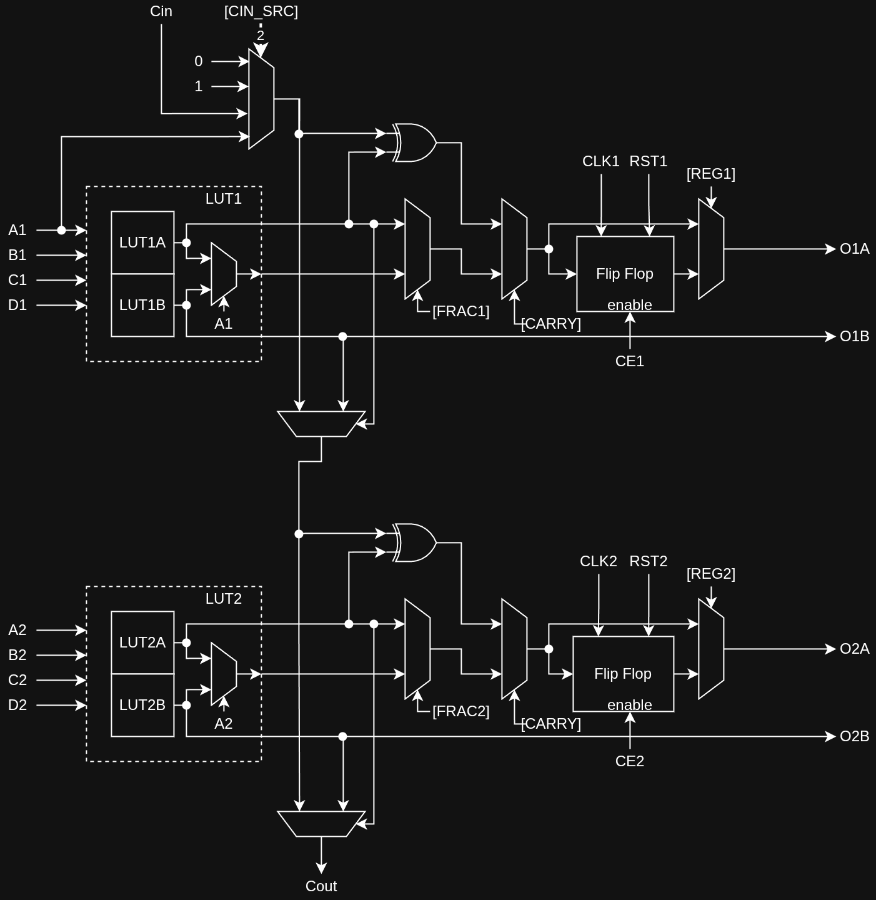
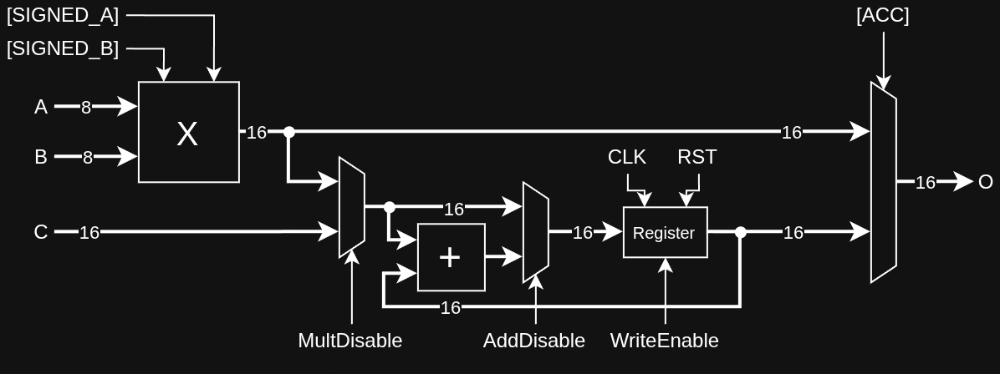
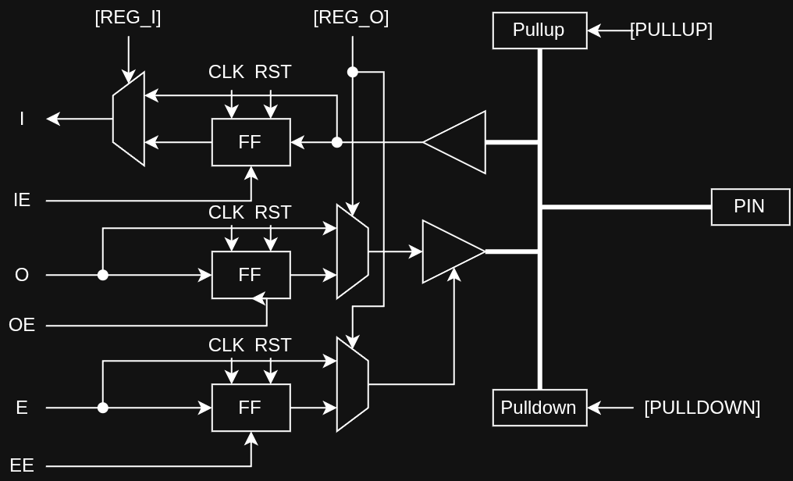

# Mica-1 Specification

Mica-1 is a *fictional* FPGA platform architecture, designed solely for educational purposes.
It is intentionally simple (so that one person can understand it fully), however contains several important features common in commercial FPGA architectures, making it interesting enough as a compilation target.

Summary of the important features:
- a regular 2D tile grid;
- 4-input LUTs;
- LUT fracturing;
- fast carry chains;
- flip-flops dedicated to every LUT;
- distributed RAM;
- block RAM;
- dedicated integer multipliers;
- deliberately simple routing architecture;
- small number of global clock networks;
- small number of global reset networks;
- configurable I/O blocks;
- textual and binary bitstream format (for ease of debugging);
- deterministic configuration;
- all behavior documented, including explicitly undefined behavior;
- no analog effects.

## Document revision

**Revision 6.** The log below starts at the first externally reviewed draft; changes before that
point were not tracked. Entries describe content, not dates.

| Rev | Changes                                                                                     |
|-----|---------------------------------------------------------------------------------------------|
| 1   | Fabric definition: tile grid, logic/BRAM/DSP/IO tiles, routing fabric, switchbox and connection box tables. |
| 2   | Clock-enable inputs added to the logic tile; clock and reset network sourcing settled; tile figures regenerated to match the text. |
| 3   | Bitstream chapter added (binary and textual, with grammar); device catalogue (`M1/S`, `M1/M`, `M1/L`); delay model completed. |
| 4   | Switchbox source tables reworked so every tile output reaches every direction; "Track numbering and segments" added; `mod` defined globally; CRC, frame units and canonical textual form pinned down; BRAM tile config split from BRAM data. |
| 5   | Truncated-wire behaviour at the grid boundary defined; external-pin model and strength ordering stated; rationale added for the BRAM/DSP connection box asymmetry; switchbox index formula added; worked examples added. |
| 6   | L1 right-turn shift changed from `(i-1) mod 6` to `(i+2) mod 6`, so the L1 fabric no longer splits into two unreachable halves; rationale recorded under the switchbox tables. Example 3 completed. |

## General architecture

As almost any FPGA, Mica FPGA is tiled: consisting of a grid of interchangeable *tiles*.
The tiling is particularly simple for Mica, simply being a 2D grid.
Main tile types are:
- **Logic tiles** (`L`) - main programmable logic, takes up most of the grid;
- **Block RAM tiles** (`B`) - static RAM, interspersed throughout the grid;
- **DSP tiles** (`D`) - dedicated integer multipliers, interspersed throughout the grid;
- **IO tiles** (`I`) - input/output pins, placed around the edge of the grid.

Logic and IO tiles take up 1x1 cells, while BRAM and DSP tiles take up 4 tall x 1 wide blocks.
In general, 4x1 tiles span whole columns, to avoid interrupting carry chains.
The interior height, therefore, must be a multiple of 4 to fit an even number of 4x1 tiles.

An intentional design choice is that all-zero configuration is valid and inert.

Example placement for a tiny Mica-1 device.
Note that this device is too tiny to be complete, real ones have ~50x50 grid minimum.
- 10x10 grid
- 48 logic tiles
- 2 BRAM tiles
- 2 DSP tiles
- 32 IO tiles

```
  0   1   2   3   4   5   6   7   8   9
┌───┬───┬───┬───┬───┬───┬───┬───┬───┬───┐
│   │ I   I   I   I   I   I   I   I │   │ 0
├───┼───┼───┼───┼───┼───┼───┼───┼───┼───┤
│ I │ L │ L │   │ L │ L │   │ L │ L │ I │ 1
├   ┼───┼───┤   ├───┼───┤   ├───┼───┼   ┤
│ I │ L │ L │   │ L │ L │   │ L │ L │ I │ 2
├   ┼───┼───┤ B ├───┼───┤ D ├───┼───┼   ┤
│ I │ L │ L │   │ L │ L │   │ L │ L │ I │ 3
├   ┼───┼───┤   ├───┼───┤   ├───┼───┼   ┤
│ I │ L │ L │   │ L │ L │   │ L │ L │ I │ 4
├   ┼───┼───┼───┼───┼───┼───┼───┼───┼   ┤
│ I │ L │ L │   │ L │ L │   │ L │ L │ I │ 5
├   ┼───┼───┤   ├───┼───┤   ├───┼───┼   ┤
│ I │ L │ L │   │ L │ L │   │ L │ L │ I │ 6
├   ┼───┼───┤ B ├───┼───┤ D ├───┼───┼   ┤
│ I │ L │ L │   │ L │ L │   │ L │ L │ I │ 7
├   ┼───┼───┤   ├───┼───┤   ├───┼───┼   ┤
│ I │ L │ L │   │ L │ L │   │ L │ L │ I │ 8
├───┼───┼───┼───┼───┼───┼───┼───┼───┼───┤
│   │ I   I   I   I   I   I   I   I │   │ 9
└───┴───┴───┴───┴───┴───┴───┴───┴───┴───┘
```

### Naming and coordinates

Cardinal directions are named north/east/south/west (often in this clockwise order).
Alternative names are up/right/down/left.
For coordinate system, `(row, col)` is used, with rows increasing from north to south,
and columns increasing from west to east.
Coordinates are 0 indexed, starting at the most north-west tile.
For 4x1 tiles, the top cell is used for coordinates of the whole tile.
Switchboxes (vertices) are addressed the same way as the tile on its north-west, so starting from (0,0).
Edges are only ever named relative to a switchbox (NESW), or to a grid cell (NESW), no global coordinate
system for them is used.
Wires in the edges are specified by their class (L1/L4/L16), track number, and direction.
Pins are numbered in NESW order, starting from the westmost pin on the north edge (pin 1).
When `mod` or `%` is used in formulas, mathematical mod is used, for example
`-1 mod 5 = 4`.

### Signal taxonomy

There are 4 signal states supported by this FPGA: `0`, `1`, `Z` and `X`.
`0` and `1` are regular low and high signal states.
`Z` is high impedance state and can only be encountered on external pins - no internal wires carry `Z`.
`X` is *undefined value*, indicating an error.

### Illegal behavior

There are three types of illegal behavior in Mica: compile-time, runtime-only, and local.

Compile-time detectable illegal behavior is detected by tooling, and often results in
compilation error instead of attempting to simulate the configuration.
Below is the full list of things that might cause misconfiguration:

- any combinatorial loops;
- switchbox connecting to non-existent sources;
- connection box connecting to non-existent sources;
- invalid configuration of a tile;
- logic tile clock-enable connected to known-`X` output.

Runtime-only detectable illegal behavior is something that cannot be detected on compile-time,
but is still illegal and causes a simulation error.
Below is full list of things that might cause simulation error:

- write-write conflict in Block RAM;
- `X` happens on clock or reset network;
- `X` happens on write-enable signal.

`X` is a local type of illegal behavior, representing a wire having undefined value.
Only that wire is compromised, and simulator does not refuse to simulate it.
`X` is propagated optimistically *per primitive*: any logic that explicitly ignores the input
proceeds without it, if it does not, `X` is propagated.
This includes ignored inputs on LUTs and BRAMs, but does not include LUTs configured to have the same value
on both inputs.
`X` generally indicates some problematic situation and should be avoided, by connecting unused inputs to constants instead.

Types of `X` detectable at compile-time (only issue a warning):

- outputs disconnected by configuration (e.g. OxB outputs of logic tile when fracturing is disabled);
- pullup and pulldown enabled at the same time;
- reading external PIN configured as clock input.

Types of `X` only detectable at run-time:

- Conflict with external driver on a PIN;
- `Z` on external PIN read by IO input without pullup/pulldown enabled.


## Logic tile

Each logic tile contains two mostly independent **Logic Elements** (LEs from now on).
Each LE contains a 4-input **Lookup Table** (LUT) and a D-type **Flip-flop** (FF).
Each of the two LEs can independently be in either *Logic*, *Fractured* or *Register* mode.
There are also two modes that connect the two LEs together into a single unit:
*Carry* mode and *Memory* mode.
Each one will be described in the following sections.
From now on, LUTs in two LEs are named LUT1 and LUT2.

Each logic tile has 10 inputs (4 for each LUT, and 2 Clock Enables), and 4 outputs (O1A, O1B, O2A, O2B).
There are also two special connections Carry In and Carry Out, which are inaccessible
through normal routing.
Each LE can be clocked separately, with clock and reset networks being independently selectable.

The modes are selected using 7 configuration bits, named `REG1, REG2, FRAC1, FRAC2, CARRY, MEM, MEM_DUAL`.
Bits `REGx, FRACx` control LE1 and LE2 independently, with LE2 behaving in exactly the same way.

| `REGx` | `FRACx` | `CARRY` | `MEM` | `MEM_DUAL` | LEx mode           | LEy mode    |
|--------|---------|---------|-------|------------|--------------------|-------------|
|    `0` |     `0` |     `0` |   `0` |      `any` | Logic              | `~`         |
|    `1` |     `0` |     `0` |   `0` |      `any` | Register           | `~`         |
|    `0` |     `1` |     `0` |   `0` |      `any` | Fractured          | `~`         |
|    `1` |     `1` |     `0` |   `0` |      `any` | Fractured Register | `~`         |
|    `0` |   `any` |     `1` |   `0` |      `any` | Carry              | `~`         |
|    `1` |   `any` |     `1` |   `0` |      `any` | Carry Register     | `~`         |
|    `0` |   `any` |     `0` |   `1` |        `0` | Memory             | Memory      |
|    `0` |   `any` |     `0` |   `1` |        `1` | Memory Dual        | Memory Dual |

Any combination not matching the table is illegal.

In total, configuration of a logic tile requires:
- 7 flags above
- 2 bits for Carry In selection
- 3x2 = 6 bits for clock selection
- 2 bits for reset enable
- 2x2 = 4 bits for reset selection
- 2x16 bits of LUT data
Therefore, Logic tile requires 53 bits of configuration.

### Logic Mode

The most basic mode of operation utilizes only the LUT, connected in the following manner:

```
       ┌──────┐
Ax ───>│      │
Bx ───>│ LUTx │───> OxA
Cx ───>│      │
Dx ───>│      │
       └──────┘
```

The lookup table can be configured to implement any 4-input Boolean function.
It is basically a 16-bit static memory cell, with ABCD inputs selecting one of its bits:
```
OxA = LUTx[Ax, Bx, Cx, Dx]
OxB = undefined
```

The ABCD inputs are considered in this order, with A being "most significant" and D being "least significant":
`index = 8*A + 4*B + 2*C + 1*D`
LUT bits are written in this order, from `ABCD = 0000` to `ABCD = 1111`

### Fractured Mode

The 4-input LUT contains 16 bits of memory, which can also be interpreted as 2 blocks of 8 bits.
That allows the 4-input LUT to become two 3-input LUTs with the same inputs.
LUT1 splits into LUT1A and LUT1B, and LUT2 splits into LUT2A and LUT2B.
The fractured mode is independent between the two LEs.

```
       ┌───────┐
Bx ───>│       │
Cx ───>│ LUTxA │───> OxA
Dx ───>│       │
       └───────┘
       ┌───────┐
Bx ───>│       │
Cx ───>│ LUTxB │───> OxB
Dx ───>│       │
       └───────┘
```

The input A is ignored in this mode.

```
OxA = LUTxA[Bx, Cx, Dx]
OxB = LUTxB[Bx, Cx, Dx]
```

In this case, LUTxA corresponds to lower half of LUTx, with `Ax = 0`,
and LUTxB - higher half with `Ax = 1`.

### Register Mode
The flip-flop connects to one of the global clock networks.
On every clock rising edge, LUTx output is written to the flip-flop if clock enable `CEx` input is high.

Flip-flop can also be optionally connected to one of the global reset networks.
The reset is synchronous and only happens on the clock edge.
On power-on flip-flop is initialized to 0.

```
RSTx ───────────────────┐
CLKx ────────────────┐  │
                 clk V  V rst
       ┌──────┐    ┌──────┐
Ax ───>│      │    │      │
Bx ───>│ LUTx │───>│ Flip │───> OxA
Cx ───>│      │    │ Flop │
Dx ───>│      │    │      │
       └──────┘    └──────┘
                      ^ enable
CEx ──────────────────┘
```

```
OxB = undefined

On rising clock edge:
    if (reset) {
        OxA <- 0
    } else if (CEx) {
        OxA <- LUTx[Ax, Bx, Cx, Dx]
    } else {
        OxA <- OxA
    }
```

### Fractured Register mode
If Fractured Mode is enabled, LUTxA can be connected to a flip-flop as its data input.
The first output is then replaced with flip-flop output.
LUTxB can continue operating independently.

```
RSTx ────────────────────┐
CLKx ─────────────────┐  │
                  clk V  V rst
       ┌───────┐    ┌──────┐
Bx ───>│       │    │ Flip │
Cx ───>│ LUTxA │───>│ Flop │───> OxA
Dx ───>│       │    │      │
       └───────┘    └──────┘
                       ^ enable
CEx ───────────────────┘
       ┌───────┐
Bx ───>│       │
Cx ───>│ LUTxB │───────────────> OxB
Dx ───>│       │
       └───────┘
```

```
OxB = LUTxB[Bx, Cx, Dx]

On rising clock edge:
    if (reset) {
        OxA <- 0
    } else if (CEx) {
        OxA <- LUTxA[Bx, Cx, Dx]
    } else {
        OxA <- OxA
    }
```

### Carry chain

Each logic tile also contains a 2-bit carry-chain connecting *both* LEs together.
When carry chain is enabled, each LUT is automatically fractured.
Each pair of LUTs produces a *Propagate/Generate* signal pair.
The general connection schematic is the following:

```
Carry In ─────────────────────────┐
                                  V
       ┌───────┐              ┌───────┐
B1 ───>│       │ Propagate 1  │       │
C1 ───>│ LUT1A │─────────────>│       │───> O1A
D1 ───>│       │              │       │
       └───────┘              │       │
       ┌───────┐              │       │
B1 ───>│       │ Generate 1   │       │
C1 ───>│ LUT1B │─────────────>│       │
D1 ───>│       │              │       │
       └───────┘              │ Carry │
       ┌───────┐              │ Chain │
B2 ───>│       │ Propagate 2  │       │
C2 ───>│ LUT2A │─────────────>│       │───> O2A
D2 ───>│       │              │       │
       └───────┘              │       │
       ┌───────┐              │       │
B2 ───>│       │ Generate 2   │       │
C2 ───>│ LUT2B │─────────────>│       │
D2 ───>│       │              │       │
       └───────┘              └───────┘
                                  └───────> Carry Out
```

The carry chain implements the following logic:
```
O1A = P1 XOR Cin
C' = P1 ? Cin : G1
O2A = P2 XOR C'
Cout = P2 ? C' : G2
O1B = G1
O2B = G2
```
Note that O1B and O2B are not undefined, even if fractured mode is not enabled.

This lets the user implement, for example, a 2-bit full adder, by configuring LUTs as
```
P1 = B1 XOR C1
G1 = B1 AND C1
P2 = B2 XOR C2
G2 = B2 AND C2
```

The benefit of this additional logic is the *dedicated carry route*: carry chains of tiles
that are vertically adjacent in the grid can be directly connected. In fact, carry input can
be configured to be one of
- Constant 0;
- Constant 1 (lets you implement counters easily);
- Input A1;
- Carry Out of the tile directly above it (cannot be used if no tile).
This special "Carry Out to Carry In" path has a lot less physical delay than normal routing,
and so implementing adders as vertical stacks of tiles is preferred for optimal performance.
The carry chain flows downwards, so northmost LE is the least significant bit.

Carry Out of the southmost (most significant) tile is automatically ignored.
Carry chain is also interrupted by non-logic tiles, if those are present.

Note: Flip Flops can still be enabled in this mode, and in that case carry chain outputs are
used as flip flop data inputs.

Full diagram of the logic tile up until now (without Memory Mode shown)



### Distributed RAM
The whole tile can also be converted into 32-bit Distributed RAM.
In this case, both LUTs are used together as a single 32-bit storage.
There are two modes of this Memory mode: 32x1 (single memory mode) and 16x2 (dual memory mode).
In the single memory mode, all 4 inputs of LUT1 (A1 to D1) plus D2, are used as an address, selecting
1 bit from 32-bit memory.
The address is calculated as `16*D2 + 8*A1 + 4*B1 + 2*C1 + 1*D1`.
Input C2 becomes write data input, and input CE1 becomes write enable.
Inputs A2, B2 and CE2 are unused.

If write enable is high, write data is written to the RAM bit selected by the address on the rising edge
of the LE1's selected clock. LE1's selected reset governs RAM clear.
Reads are asynchronous, with read-first behavior:
if write enable is high, the read outputs *old* data, not newly written data.
LUT initialization bits are the Distributed RAM's initial data.

The schematic is then

```
Reset ──────────┐
Clock ───────┐  │
         clk V  V rst
   address ┌─────┐
D1 ───────>│     │
C1 ───────>│     │
B1 ───────>│     │
A1 ───────>│     │
D2 ───────>│     │ read
           │     │ data
   write   │ RAM │──────> O1A
   data    │     │
C2 ───────>│ 32  │
           │ bit │
   write   │     │
   enable  │     │
CE1 ──────>│     │
           └─────┘
```

```
O1A = RAM[D2,A1,B1,C1,D1]
O1B,O2A,O2B = undefined

On rising clock edge:
    if (reset) {
        RAM[*] <- 0
    } else if (CE1) {
        RAM[D2,A1,B1,C1,D1] <- C2
    }
```

In the dual memory mode, LUTs act as separate 16-bit memories, both using A1 to D1 as address.
The address is calculated as `8*A1 + 4*B1 + 2*C1 + 1*D1`.
They produce 2 bits of output, so we need two write data inputs, D2 and C2,
with CE1 still acting as shared write enable.
Inputs A2, B2 and CE2 are unused.

```
Reset ──────────┐
Clock ───────┐  │
         clk V  V rst
   address ┌─────┐
D1 ───────>│     │
C1 ───────>│     │
B1 ───────>│     │
A1 ───────>│     │ read
           │     │ data
   write   │ RAM │──────> O1A
   data    │     │──────> O2A
D2 ───────>│ 2x  │
C2 ───────>│ 16  │
           │ bit │
   write   │     │
   enable  │     │
CE1 ──────>│     │
           └─────┘
```

```
O1A = RAM1[A1,B1,C1,D1]
O2A = RAM2[A1,B1,C1,D1]
O1B,O2B = undefined

On rising clock edge:
    if (reset) {
        RAM1[*] <- 0
        RAM2[*] <- 0
    } else if (CE1) {
        RAM1[A1,B1,C1,D1] <- D2
        RAM2[A1,B1,C1,D1] <- C2
    }
```

## Block RAM tile

Block RAM is an efficiently-packed static RAM, containing 4096 bits of memory per 4x1 tile.
Those 4096 bits can be arranged with the following widths:

| Code  |  Mode  | Depth | Address width | Data width |
|-------|--------|------:|--------------:|-----------:|
| `000` | 4096x1 |  4096 |            12 |          1 |
| `001` | 2048x2 |  2048 |            11 |          2 |
| `010` | 1024x4 |  1024 |            10 |          4 |
| `011` |  512x8 |   512 |             9 |          8 |
| `100` | 256x16 |   256 |             8 |         16 |

Block RAM configuration requires:
- 3 width selection bits
- 3 clock selection bits
- 4096 bits of initial data
So 4102 configuration bits in total.

All the modes except 256x16 are automatically dual-port.
Each port contains an address bus, data input bus, data output bus, and a single write enable wire.
When `Address width < 12` or `Data width < 16`, lower bits of the input/output are used.
Unused data output bits have `X` in them and should not be used.

When dual-port mode is active, all these buses are duplicated, with data buses taking up higher DW bits.
The two ports operate independently and allow reading and writing data to RAM at the same time.
Reads are asynchronous, writes are synchronous, reset is not supported.
When write enable is high, *current* value is read, not newly written one.
The BRAM starts either in all-zero or pre-configured state.
In total, the block RAM has the following interface:

- 24 x address inputs, 12 x for each of the two ports
- 16 x data inputs
- 16 x data outputs
- 2 x write enables

So here are the schematics for single and dual port operation (N being address width, M - data width)

```
Clock ─────────────┐
               clk V
                ┌─────┐
A[0..N-1]  ────>│     │
DI[0..M-1] ────>│ RAM │────> DO[0..M-1]
WE         ────>│     │
                └─────┘
```

```
Clock ──────────────┐
                clk V
                 ┌─────┐
A1[0..N-1]  ────>│     │
DI[0..M-1]  ────>│     │────> DO[0..M-1]
WE1         ────>│     │
                 │ RAM │
A2[0..N-1]  ────>│     │
DI[M..2M-1] ────>│     │────> DO[M..2M-1]
WE2         ────>│     │
                 └─────┘
```

The logic of operation is the following, with dual port mode having two copies of it:

```
DO = RAM[A]
On rising clock edge:
    if (WE) {
        RAM[A] <- DI
    }
```

Write-write conflict, when both ports write to the same address,
is considered illegal behavior and crashes the simulation.
Read-write conflicts, when one port writes data to an address and the other reads it,
are legal and the *old* value of the address is read, not newly written.

## DSP tile

Since integer multiplies are expensive to implement in LUTs, there are dedicated DSP 4x1 tiles.
Each DSP tile implements 8-bit wide multiply with optional 16-bit accumulator.
The DSP interface is
- 8 x A inputs
- 8 x B inputs
- 16 x C inputs
- 16 x O outputs
- 1 x multiply disable wire
- 1 x add disable wire
- 1 x write enable wire

The schematic of the DSP tile is the following:



O output can be selected to be either 16-bit product A * B, or registered accumulator output.
Whether A and B are interpreted as signed is also specified via configuration.
C and O are interpreted as signed when either A or B are signed.

DSP tile configuration requires:
- 2 sign bits
- 1 accumulator output select bit (`ACC`)
- 3 clock selection bits
- 1 reset enable bit
- 2 reset selection bit
So 9 configuration bits in total.

The accumulator is only updated when write-enable signal is high.
On power-on accumulator is initialized to 0.
Depending on the inputs specified by multiply-disable (`MD`) and add-disable (`AD`), we get following four operations:
1. `MD = 1, AD = 1: ACC <- C` - load mode;
2. `MD = 1, AD = 0: ACC <- ACC + C` - add mode;
3. `MD = 0, AD = 1: ACC <- A*B` - multiply mode;
4. `MD = 0, AD = 0: ACC <- ACC + A*B` - multiply-add mode.

When overflow happens in accumulator, the value wraps.

## IO tile

For connection to the outside world, Input-Output tiles are used.
Since Mica is not a real physical device, the following section is rather simplified, with no real
electrical characteristics being considered, not even slew rate.

Each IO tile has an input buffer, output driver (a tri-state buffer), and optional pullup/pulldown resistors.
The schematic of IO tile is the following:



Pullup and pulldown resistors can be enabled by configuration, and they ensure the input buffer is never in
high-impedance state (`Z`). If pullup is enabled, `Z` becomes `1`, and if pulldown is enabled, `Z` becomes `0`.
If both or neither is enabled, `Z` is read by the input buffer as *undefined* state `X`.
Enabling both is flagged by the tools as a warning.

Input buffer is always active and presents the state of the IO pin at the `I` output.
That input can be optionally registered, with a separate enable signal.

For the output, when `E` input is enabled, output driver sets the IO pin to the value of `O` input.
The output driver is strong enough to override any pullup/pulldown resistors, if those are enabled.
The full strength ordering is therefore: external driver > output driver > pullup/pulldown resistor.
In particular, when the output driver and an external driver disagree, the pin takes the *external*
value, while the input buffer reads `X` to flag the contention; both are shown in the table below.
Both of these can also be registered, with separate enable signals:
`IE` for input register enable, `OE` for output register enable, `EE` for output-enable register enable.
Output and output-enable registers share a single configuration bit and are enabled together.
On power-on registers are initialized to 0.

Externally, electronics attached to the pin are not simulated.
For simplicity, external state is considered to be an external driver that can be set to either
`Z`, `0`, or `1`, or an external sensor that can sense the external pin state (or both, for
bidirectional pins).

Below is the summary table of interactions of the external driver and IO tile.

| External driver | IO output | `PULLUP` | `PULLDOWN` | `I` state | External PIN state |
|----------------:|----------:|---------:|-----------:|----------:|--------------------|
|             `Z` |  disabled |      `0` |        `0` |       `X` | high-impedance     |
|             `Z` |  disabled |      `0` |        `1` |       `0` | low                |
|             `Z` |  disabled |      `1` |        `0` |       `1` | high               |
|             `Z` |  disabled |      `1` |        `1` |       `X` | undefined          |
|             `Z` |       `0` |      any |        any |       `0` | low                |
|             `Z` |       `1` |      any |        any |       `1` | high               |
|             `0` |  disabled |      any |        any |       `0` | low                |
|             `0` |       `0` |      any |        any |       `0` | low                |
|             `0` |       `1` |      any |        any |       `X` | low                |
|             `1` |  disabled |      any |        any |       `1` | high               |
|             `1` |       `0` |      any |        any |       `X` | high               |
|             `1` |       `1` |      any |        any |       `1` | high               |

Some of the pins can also optionally be configured as *clock* or *reset* inputs,
in which case they are unusable as IO pins,
and instead are connected to the global clock/reset network.
The output of this tile is then `X`, and inputs do nothing.

IO tile configuration requires:
- 2 register enable bits
- 2 pullup/pulldown bits
- 3 clock selection bits
- 1 reset enable bit
- 2 reset selection bit
So 10 configuration bits in total.

Clock and reset inputs are enabled separately, 1 bit of configuration per clock/reset capable pin.
Specific clock/reset capable pins are defined per device variant.
If the clock/reset input is not enabled, the corresponding clock/reset network carries constant 0,
so they never trigger.

## Routing

Routing fabric is arguably the most important part of an FPGA, connecting various components together
with configurable wiring. The following sections describe various aspects of the routing system in Mica-1 devices.

### Global clock networks

The device has 8 global clock networks (numbered `CLK0` to `CLK7`), spanning the whole device.
These global clock networks originate from the 8 clock-capable IO pins, that can be optionally enabled.
All flip-flops (in logic tiles, accumulator in DSP tiles, and all the BRAM tiles, and IO tiles)
have to choose one of the 8 clock networks to attach to,
and all are activated on the rising edge of the clock (when the signal goes from `0` to `1` state).
Clock network cannot be driven from internal logic, and cannot be read as data.

### Global reset networks

The device has 4 global reset networks, spanning the whole device.
The signals originate from special reset pins.
All flip-flops except BRAM (in logic tiles, accumulator in DSP tiles, and IO tiles)
can be optionally assigned to the reset network, and if they are, they are synchronously
reset to `0` if the reset signal is high on the clock rising edge.
Reset network cannot be driven from internal logic, and cannot be read as data.

### Carry chains

All the logic tiles in a vertical column on the 2D grid are connected together via a specialized *carry chain*.
If carry mode is enabled on several of the tiles in the column, they act together as a single adder unit.
The carry chain is especially useful since it has low propagation delay compared to general routing.
Only the tiles in each vertical columns share a carry chain, there is no way to transfer carry to a different
column without using general routing.

### General routing fabric

Most of the signals in FPGA propagate through general routing fabric.
The *wires* in it run along the boundaries of tiles, connected together via *switchboxes*, placed on vertices.
Each tile has its inputs connected to the edges left/right/above/below it, shared with a neighbour tile,
and also internal edges for 4x1 tiles.
Each tile outputs are connected to the switchboxes (4 for logic tiles, 2 for IO tiles, 10 for DSP and BRAM tiles).
The wires are *segmented*, each segment of a wire acting as a single unit.
Mica has segments of lengths 1 (short, L1), 4 (medium, L4) and 16 (long, L16).
The 4x1 tiles *do not* interrupt the routing: the internal edges still have the full set of wires.

All the wires are *unidirectional*: each wire segment has exactly one source and one or more sinks.
The source is the multiplexer at the switchbox where the segment *begins*.
The sinks are the connection boxes that tap the segment anywhere along its span,
and the switchboxes that pass it on further downstream.

Note that "one source per segment" is a property of the encoding rather than a rule to observe:
each outgoing wire of a switchbox has exactly one 4-bit source multiplexer, and there is no way
to express a second driver, or a driver at a switchbox the segment merely passes through.
What *does* require care is knowing which segment a given track number refers to on a given edge -
see "Track numbering and segments" below.

At any boundary between two tiles in Mica-1, there are *36* independent tracks of wires, 18 tracks in each direction.

The 18 wires are split in the following way.
`[ ]` represents a switchbox.
`[X]` represents a switchbox where a wire segment ends and another one begins.
`--1--` represents an wire of length 1
`--4--` represents an wire of length 4
- 6 x L1 wires, connecting adjacent segments
  ```
  [X]--1->[X]--1->[X] x6
  ```
- 8 x L4 wires, 2 starting and ending at each of the switchboxes
  ```
  [X]--1--[ ]--1--[ ]--1--[ ]--1->[X] x2
  [ ]--1->[X]--1--[ ]--1--[ ]--1--[ ] x2
  [ ]--1--[ ]--1->[X]--1--[ ]--1--[ ] x2
  [ ]--1--[ ]--1--[ ]--1->[X]--1--[ ] x2
  ```
- 4 x L16 wires, new one starting and ending every 4 tiles.
  ```
  [X]--4--[ ]--4--[ ]--4--[ ]--4->[X] x1
  [ ]--4->[X]--4--[ ]--4--[ ]--4--[ ] x1
  [ ]--4--[ ]--4->[X]--4--[ ]--4--[ ] x1
  [ ]--4--[ ]--4--[ ]--4->[X]--4--[ ] x1
  ```
This means, vertical L16 wires start at switchboxes with `row ≡ 0 (mod 4)`, and horizontal wires
start at switchboxes with `col ≡ 0 (mod 4)`. Only when both are true a switchbox has all 4 x L16 wires.
Near the edges, some of the medium and long wires might end early, effectively becoming shorter wires.
The important consequences of this is that the truncated wires *do not have switchbox connections at the end*.
This effectively makes them dead ends - truncated wires going towards the edge have nowhere to go,
so can only be used as sources for adjacent tiles,
and truncated wires going *away* from the edge can't even carry any useful signals,
and are effectively absent.

Quantitatively, at the last switchbox of each row and column every track terminates at once,
because truncation collapses all the overrunning segments onto the same box:
all 8 L4 tracks and all 4 L16 tracks end there, of which only `L4[dir][0..1]` and (when
`n ≡ 0 (mod 4)`) `L16[dir][0]` can be addressed - so 6 of 8 L4 and 3 of 4 L16 segments are
dead ends. The practical consequence is that a signal cannot *turn* within 3 edges (L4) or
16 edges (L16) of the grid boundary; the final approach to a boundary switchbox must arrive
on an L1 wire, which starts and ends at every box and so is never truncated.

Also, near the IO tiles, wires are actually absent, following this pattern:

```
┌─────┬─────┬─────┬
│     │     │     │
│     │  I  │  I  │
│     │     │     │
├─────█<═══>█<═══>█
│     ^     ^     ^
│  I  ║  L  ║  L  ║
│     v     v     v
├─────█<═══>█<═══>█
│     ^     ^     ^
│  I  ║  L  ║  L  ║
│     v     v     v
├─────█<═══>█<═══>█
```
with `█` representing switchboxes, `═` representing wires, and `─` representing edges without them.
All the IO tiles along the north edge connect to the south wires, tiles along west edge - east wires etc.
The corners are inert and have no functional tiles.
Switchboxes are only present on internal vertices, so all IO tiles have access to two switchboxes.

Creating cycles with wires is *illegal behavior*: do not do this in a valid design.

#### Track numbering and segments

Wires on an edge are identified by track number, separately for each of the two directions:
L1 tracks `0..5`, L4 tracks `0..7`, L16 tracks `0..3`.
Connection boxes address wires this way (see "Connection boxes").

Switchboxes address them differently: `L4[dir][0..1]` and `L16[dir][0]` mean the segments that
start and end *at that particular box*, of which there are only 2 and 1 per side respectively.
The two numbering schemes are related through the *phase* of the switchbox.
For vertical (north/south) wires the phase is derived from `row`, for horizontal (east/west)
wires from `col`; below, `n` stands for whichever of the two applies:

| Switchbox index | Present when   | Starting edge track |
|-----------------|----------------|---------------------|
| `L1[dir][i]`    | always         | `i`                 |
| `L4[dir][u]`    | always         | `2 * (n mod 4) + u` |
| `L16[dir][0]`   | `n ≡ 0 (mod 4)`| `(n / 4) mod 4`     |

with `/` being integer division. L1 segments start and end at every switchbox, so their track
numbers need no adjustment. Every switchbox starts 2 of the 8 L4 wires, and one in four
switchboxes starts 1 of the 4 L16 wires, matching the stagger diagrams above.

L4 tracks are grouped into phases as `{0,1}, {2,3}, {4,5}, {6,7}` rather than by residue, so that
every phase holds one even and one odd track. This matters because connection box parity classes
are `{0,2,4,6}` and `{1,3,5,7}` (see "Logic tile inputs").

The same cannot be arranged for L16, since only one L16 wire starts at a box: an L16 launched from
a given switchbox always lands on L16 track `(n / 4) mod 4`, and so is readable only by the
connection boxes of that track's parity, `(n / 4) mod 2`.
This is a real constraint on long-distance routing, and worth keeping in mind when placing a
signal that has to travel far.

A track number therefore names a *slot on an edge*, not a wire. Because L4 and L16 wires are
staggered, track `n` on one edge and track `n` further along the same boundary can belong to
different segments driven by different sources:

```
box:  0       1       2       3       4       5       6
     [X]-----[ ]-----[ ]-----[ ]-----[X]-----[ ]-----[ ]
          e0      e1      e2      e3      e4      e5

L4 track 0:
     [X]============================>[X]==================>
      ^                               ^
      driven by box 0                 a new segment,
                                      driven by box 4
```

Connection boxes on edges `e0` to `e3` tap the first segment; a connection box on `e4` taps the
second one - same track number, different wire, different signal. Both are perfectly legal
configurations, and nothing in the format distinguishes them, so tapping one edge too far along a
segment is a silent error.

### Switchboxes

At each vertex of the 2D grid, there is a *switchbox*, responsible for connecting wire segments together.
For most switchboxes, there are 8 incoming wires on each side:
6 x L1 wires and 2 x L4 wires starting/ending at that switchbox per side, so 32 L1/L4 wires segments in total.
In some switchboxes, there are also additional L16 wires starting and ending there, 1 per side.

Each of the outgoing wires is driven by one of 16 possible sources, encoded by 4 bits.
12 of them are other wires in the switchbox, but 4 are *outputs* of the 4 tiles nearby.
Each of the tiles can only have 4 outputs assigned to a switchbox.
The tiles are ordered from `T[0]` to `T[3]` in order NW, NE, SE, SW.
If a wire is not going to be used by anything, assign it to one of the nearby tile outputs.
For inert corners, `T[?]` evaluates to *0 value*; in the textual format such a source is written
`<corner>.ZERO`, for example `NW.ZERO`, since an inert corner has no outputs to name.
So to disable a wire, you can always use `0` code, corresponding to `T[0]`.
This "disabled wire" might not always have *0 value*, but it is considered disabled
by the tools if no other wires connect to it.

All the connections either go straight, turn left, or turn right, there are no U-turns.

Some incoming wires might be missing due to geometry, then sourcing the outgoing wire from
any one of them is *illegal*.

If the current side is labeled `s` (N = 0, E = 1, S = 2, W = 3), then the possible directions
are `rgt = (s+1)%4`, `str = (s+2)%4` and `lft = (s+3)%4`.

There are 3 classes of outgoing wires: 6 x L1 wires, 2 x L4 wires, and optional 1 x L16 wire, 9 wires per side. Each class has its own routing table, shown below.
While L16 wires are only present in ~1/4 (per side) of all switchboxes,
and all 4 of them are present only in ~1/16, the codes corresponding to them are present in all switchboxes.
Reading from them is *illegal* as well.

For L1 outgoing wire, track `i = 0..5`:
| Code     | Source                                            |
|----------|---------------------------------------------------|
| `0..3`   | `T[code].O[(i+s+code) mod 4]`                     |
| `4`      | `L1[str][i]`                                      |
| `5`      | `L1[lft][(i+1) mod 6]`                            |
| `6`      | `L1[rgt][(i+2) mod 6]`                            |
| `7..12`  | `L4[str][0..1]`, `L4[lft][0..1]`, `L4[rgt][0..1]` |
| `13..15` | `L16[str][0]`, `L16[lft][0]`, `L16[rgt][0]`       |

The two turn shifts are deliberately asymmetric: `+1` one way and `+2` the other. Making them
`+1` and `-1` looks tidier but is wrong. Returning to the original direction takes a net turn
count that is a multiple of 4, so with symmetric shifts the track index could only ever move by a
multiple of 4 taken mod 6 - that is, by an even amount. The L1 fabric would then split into two
disjoint 3-track networks, `(track + direction) mod 2` being conserved by every hop, and no
sequence of L1 hops could ever cross between them. With `+1` and `+2` a right turn followed by a
left turn shifts the track by one, so all six tracks stay mutually reachable.

For L4 outgoing wire, track `u = 0..1`:
| Code     | Source                                            |
|----------|---------------------------------------------------|
| `0..3`   | `T[code].O[(u+s+code) mod 4]`                     |
| `4..9`   | `L4[str][0..1]`, `L4[lft][0..1]`, `L4[rgt][0..1]` |
| `10..12` | `L16[str][0]`, `L16[lft][0]`, `L16[rgt][0]`       |
| `13`     | `L1[str][3u]`                                     |
| `14`     | `L1[lft][3u+1]`                                   |
| `15`     | `L1[rgt][3u+2]`                                   |

For L16 outgoing wire:
| Code    | Source                                            |
|---------|---------------------------------------------------|
| `0..3`  | `T[code].O[(s+code) mod 4]`                       |
| `4..6`  | `L16[str][0]`, `L16[lft][0]`, `L16[rgt][0]`       |
| `7..12` | `L4[str][0..1]`, `L4[lft][0..1]`, `L4[rgt][0..1]` |
| `13`    | `L1[str][4]`                                      |
| `14`    | `L1[lft][5]`                                      |
| `15`    | `L1[rgt][5]`                                      |
L16 wires are present only in some switchboxes, but the corresponding 4 bits of configuration
are kept for all switchboxes for simplicity.

So in total, for 9x4 outgoing wires per switchbox, and 4 bits per wire,
we get 144 configuration bits per switchbox.

Outputs are assigned differently for tile types.
- For logic tiles, we have exactly 4 outputs (from 4 fractured LUTs), which correspond to `O[0..3]`
in the formulas: `O[0] = O1A, O[1] = O1B, O[2] = O2A, O[3] = O2B`.
- For IO tiles, we only have 1 output `I`, so `O[0..3] = I`.
- For DSP and BRAM tiles, there are 4 grid cells, and total 16 outputs.
  That means top cells exposes `0..3` bits of output to nearby switchboxes,
  second cell exposes `4..7`, third cell exposes `8..11`, and bottom cell exposes `12..15`.

### Connection boxes
For inputs, connection boxes are placed along the grid edges.
Each input can only connect to one of its sources, so it is encoded by index, not by one-hot encoding.
Each tile class has separate input assignments, so they all are covered separately.
In general, "rigid" pins (ones that require a specific signal, like DSP inputs) get 5 bit multiplexers,
and so do pins in Logic tiles because there are so few of them.
"Flexible" pins (ones that are part of big equivalence class, like BRAM's addresses and data) get 4 bit multiplexers.

#### Common terms

For 1x1 tiles, there are 4 sides: N, E, S, W.
In each of the edges, there are 2 directions of wires.
We define *clockwise* (CW) and *counterclockwise* (CCW) directions for wires relative to a tile.
Clockwise: N edge goes east, E goes south, S goes west, W goes north.
Counterclockwise: N edge goes west, E goes north, S goes east, W goes south.

For 4x1 tiles, there are 13 sides: `W{0..3}, E{0..3}, H{0..4}`, shown by this diagram:

```
   ┌───H0───┐
W0 │ cell 0 │ E0
   ├───H1───┤
W1 │ cell 1 │ E1
   ├───H2───┤
W2 │ cell 2 │ E2
   ├───H3───┤
W3 │ cell 3 │ E3
   └───H4───┘
```

For `W{0..3}, E{0..3}, H0, H4`, the CW and CCW directions are defined as usual.
For internal `H{1..3}` edges, no CW and CCW directions are defined, and W/E should be used.

For each (side, direction) we have 18 wires in the edge.
We often split them by parity, we get 9.
We define a canonical order of these wires (interleaved for more useful mixes):
```
idx:    0      1      2       3      4      5      6      7       8
      L1[a]  L4[a]  L16[a]  L1[b]  L4[b]  L4[c]  L1[c]  L16[b]  L4[d]
```
where `a,b,c,d` are defined by parity:
- Even parity: `a = 0, b = 2, c = 4, d = 6`.
- Odd parity: `a = 1, b = 3, c = 5, d = 7`.

Then, `W(n,d)` means taking a window of N wires from this list, starting form offset d, mod 9.
For example, for even parity, `W(n=3,d=5)` means `L4[4], L1[4], L16[2]`.

n is usually defined per connection code, while d is defined per side or per input.

We also often define "primary" and "secondary" sides for each input, to evenly distribute
inputs across all sides.

#### Logic tile inputs

Each logic tile has 10 inputs: A1, B1, C1, D1, CE1, A2, B2, C2, D2, CE2.
Each input connection box has 5 bits of configuration, with 32 possible inputs each.
These ABCD inputs are mostly interchangeable (except A which is dropped when fractured, and A1 for carry in),
To achieve that, we first define *primary* and *secondary* sides for each input, and also parity:

| Input | Primary | Primary parity | Secondary | Secondary parity |
|-------|---------|----------------|-----------|------------------|
| A1    | N       | even           | S         | odd              |
| B1    | E       | even           | W         | odd              |
| C1    | S       | even           | N         | odd              |
| D1    | W       | even           | E         | odd              |
| CE1   | -       | even           | -         | -                |
| A2    | S       | odd            | N         | even             |
| B2    | W       | odd            | E         | even             |
| C2    | N       | odd            | S         | even             |
| D2    | E       | odd            | W         | even             |
| CE2   | -       | odd            | -         | -                |

As you can see, 4 sides of the tile are distributed across 4 ABCD inputs as primary sides.
Secondary sides are always directly opposite primary sides.
For the LUT1, parity is even for primary side, and odd for secondary inputs.
For the LUT2, primary and secondary sides are swapped, including parity.
Also, secondary wires in LUT1 go clockwise, while in LUT2 they go counterclockwise.
CE1 and CE2 signals are different, to be covered later.

Then, lastly, 32 possible codes for each input correspond to these possible sourced:

| Code     | Source                                     | Count |
|----------|--------------------------------------------|------:|
| `0`      | constant 0                                 |     1 |
| `1`      | constant 1                                 |     1 |
| `2..5`   | local outputs `O1A`, `O1B`, `O2A`, `O2B`   |     4 |
| `6..8`   | primary side, L1, CW                       |     3 |
| `9..11`  | primary side, L1, CCW                      |     3 |
| `12..15` | primary side, L4, CW                       |     4 |
| `16..19` | primary side, L4, CCW                      |     4 |
| `20..21` | primary side, L16, CW                      |     2 |
| `22..23` | primary side, L16, CCW                     |     2 |
| `24..31` | secondary side and direction, `W(n=8,d=1)` |     8 |
|          |                                            |    32 |

For CE1 (even parity) and CE2 (odd parity) signals, the codes are different:
| Code     | Source                                     | Count |
|----------|--------------------------------------------|------:|
| `0`      | constant 0                                 |     1 |
| `1`      | constant 1                                 |     1 |
| `2..3`   | local outputs `O1B`, `O2B`                 |     2 |
| `4..10`  | N side, CW `W(n=4,d=4)` + CCW `W(n=3,d=6)` |     7 |
| `11..17` | E side, CW `W(n=4,d=4)` + CCW `W(n=3,d=6)` |     7 |
| `18..24` | S side, CW `W(n=4,d=4)` + CCW `W(n=3,d=6)` |     7 |
| `25..31` | W side, CW `W(n=4,d=4)` + CCW `W(n=3,d=6)` |     7 |
|          |                                            |    32 |

Note how local outputs of the logic tile are also accessible without any wiring.
In total, there are 10x5 = 50 bits of input configuration per logic tiles.

#### Block RAM inputs

Block RAM has 4 tiles to use for inputs, with 13 relevant edges.
10 of them are going around the 4x1 tile, with 3 going directly through.

For the 10 outer edges, split 36 wires into 4 "slots".
Parity is defined the same way as in the previous section.
| Slot | Parity | Primary/Secondary direction |           Wires         |
|------|--------|-----------------------------|------------------------:|
| 0    | even   | CW/east                     | 3xL1 + 4xL4 + 2xL16 = 9 |
| 1    | even   | CCW/west                    |                       9 |
| 2    | odd    | CW/east                     |                       9 |
| 3    | odd    | CCW/west                    |                       9 |

To all the outer edges, we assign 4 input bits each, in the following way:
| Edge | Secondary edge | `d` |  Slot 0  |  Slot 1  |  Slot 2  |  Slot 3  |
|------|----------------|-----|----------|----------|----------|----------|
| `H0` | `H1`           |   0 | `A1[0]`  | `A2[0]`  | `A1[1]`  | `A2[1]`  |
| `W0` | `H1`           |   2 | `A1[2]`  | `A2[2]`  | `DI[0]`  | `DI[1]`  |
| `E0` | `H1`           |   4 | `A1[3]`  | `A2[3]`  | `DI[2]`  | `DI[3]`  |
| `W1` | `H2`           |   0 | `DI[5]`  | `A1[4]`  | `A2[4]`  | `DI[4]`  |
| `E1` | `H2`           |   2 | `DI[7]`  | `A1[5]`  | `A2[5]`  | `DI[6]`  |
| `W2` | `H2`           |   4 | `DI[8]`  | `DI[9]`  | `A1[6]`  | `A2[6]`  |
| `E2` | `H2`           |   6 | `DI[10]` | `DI[11]` | `A1[7]`  | `A2[7]`  |
| `W3` | `H3`           |   0 | `A2[8]`  | `DI[12]` | `DI[13]` | `A1[8]`  |
| `E3` | `H3`           |   2 | `A2[9]`  | `DI[14]` | `DI[15]` | `A1[9]`  |
| `H4` | `H3`           |   4 | `A1[10]` | `A2[10]` | `A1[11]` | `A2[11]` |

These 10 outer edges carry 40 inputs in total (`A1[0..11]`, `A2[0..11]` and `DI[0..15]`), and
each takes its secondary wires from one of the 3 internal edges, so the load cannot be spread
more evenly than 4/3/3. `H2` is therefore the expected hotspot, serving 4 edges x 4 slots = 16
signals against 12 each for `H1` and `H3`. The `d` column staggers the 5-wire windows of the
edges sharing an internal edge, so all of them remain simultaneously satisfiable.

Internal edges are used for the secondary wires because `H1`, `H2` and `H3` are *private* to the
BRAM tile, while `H0` and `H4` are shared with the tiles above and below it. Spreading the
secondary load onto the internal edges keeps this contention inside the tile. The DSP needs two
secondary edges per input rather than one, so it cannot stay inside and does reach onto `H0`/`H4`.

Each of the address/data inputs have 4 bits of configuration, up to 16 sources:
| Code     | Source                                                          | Count |
|----------|-----------------------------------------------------------------|------:|
| `0`      | constant 0                                                      |     1 |
| `1`      | constant 1                                                      |     1 |
| `2..4`   | primary edge, L1, own parity + direction                        |     3 |
| `5..8`   | primary edge, L4, own parity + direction                        |     4 |
| `9..10`  | primary edge, L16, own parity + direction                       |     2 |
| `11..15` | secondary edge, opposite parity, `W(n=5,d)`                     |     5 |
|          |                                                                 |    16 |

Write enable inputs are different, mostly occupying internal edges `H1,H2,H3`.
`WE1` occupies even parity wires, `WE2` - odd parity. Both get 5 bits each.

| Code     | Source                   | Count |
|----------|--------------------------|------:|
| `0`      | constant 0               |     1 |
| `1`      | constant 1               |     1 |
| `2..6`   | `H1`, west, `W(n=5,d=7)` |     5 |
| `7..11`  | `H1`, east, `W(n=5,d=7)` |     5 |
| `12..16` | `H2`, west, `W(n=5,d=7)` |     5 |
| `17..21` | `H2`, east, `W(n=5,d=7)` |     5 |
| `22..26` | `H3`, west, `W(n=5,d=7)` |     5 |
| `27..31` | `H3`, east, `W(n=5,d=7)` |     5 |
|          |                          |    32 |

In total, BRAM routing requires 40x4 + 2x5 = 170 bits of configuration

#### DSP inputs

Similar to BRAM, but all inputs are "rigid", so get 5 bit multiplexers:
This means for best access we can get *both* directions on the primary edge, 18 wires.

| Kind | Parity | Secondary edge |           Wires              |
|------|--------|----------------|-----------------------------:|
|    0 | even   |              1 | 2x(3xL1 + 4xL4 + 2xL16) = 18 |
|    1 | even   |              2 |                           18 |
|    2 | odd    |              1 |                           18 |
|    3 | odd    |              2 |                           18 |

| Edge | Kind 0  | Kind 1  | Kind 2  | Kind 3  |
|------|---------|---------|---------|---------|
| `W0` | `A[0]`  | `C[0]`  | `B[0]`  | `C[1]`  |
| `E0` | `C[2]`  | `B[1]`  | `C[3]`  | `A[1]`  |
| `W1` | `B[2]`  | `C[4]`  | `A[2]`  | `C[5]`  |
| `E1` | `C[6]`  | `A[3]`  | `C[7]`  | `B[3]`  |
| `W2` | `A[4]`  | `C[8]`  | `B[4]`  | `C[9]`  |
| `E2` | `C[10]` | `B[5]`  | `C[11]` | `A[5]`  |
| `W3` | `B[6]`  | `C[12]` | `A[6]`  | `C[13]` |
| `E3` | `C[14]` | `A[7]`  | `C[15]` | `B[7]`  |

For these edges, we define *two* secondary ones, with separate `d` values:

| Primary edge | Secondary edge 1 | `d1` | Secondary edge 2 | `d2` |
|--------------|------------------|------|------------------|------|
| `W0`         | `H0`             |    0 | `H1`             |    0 |
| `E0`         | `H0`             |    4 | `H1`             |    2 |
| `W1`         | `H1`             |    4 | `H2`             |    0 |
| `E1`         | `H1`             |    6 | `H2`             |    2 |
| `W2`         | `H2`             |    4 | `H3`             |    0 |
| `E2`         | `H2`             |    6 | `H3`             |    2 |
| `W3`         | `H3`             |    4 | `H4`             |    0 |
| `E3`         | `H3`             |    6 | `H4`             |    4 |


For A,B,C inputs:
| Code     | Source                                            | Count |
|----------|---------------------------------------------------|------:|
| `0`      | constant 0                                        |     1 |
| `1`      | constant 1                                        |     1 |
| `2..4`   | primary edge, L1, own parity, CW                  |     3 |
| `5..7`   | primary edge, L1, own parity, CCW                 |     3 |
| `8..11`  | primary edge, L4, own parity, CW                  |     4 |
| `12..15` | primary edge, L4, own parity, CCW                 |     4 |
| `16..17` | primary edge, L16, own parity, CW                 |     2 |
| `18..19` | primary edge, L16, own parity, CCW                |     2 |
| `20..25` | secondary edge, opposite parity, west, `W(n=6,d)` |     6 |
| `26..31` | secondary edge, opposite parity, east, `W(n=6,d)` |     6 |
|          |                                                   |    32 |

For MD,AD,WE inputs (all use even parity):
| Code     | Source                   | Count |
|----------|--------------------------|------:|
| `0`      | constant 0               |     1 |
| `1`      | constant 1               |     1 |
| `2..6`   | `H1`, west, `W(n=5,d=7)` |     5 |
| `7..11`  | `H1`, east, `W(n=5,d=7)` |     5 |
| `12..16` | `H2`, west, `W(n=5,d=7)` |     5 |
| `17..21` | `H2`, east, `W(n=5,d=7)` |     5 |
| `22..26` | `H3`, west, `W(n=5,d=7)` |     5 |
| `27..31` | `H3`, east, `W(n=5,d=7)` |     5 |
|          |                          |    32 |

In total, DSP tiles require 32x5 + 3x5 = 175 bits of configuration.

#### IO inputs

Each IO tile has 5 inputs: `O`, `E`, `IE`, `OE` and `EE`.
Each IO tile is only adjacent to one edge, so all of the inputs are sourced from it.

| Input | Primary parity | `d` |
|-------|----------------|-----|
| `O`   | even           |   0 |
| `E`   | odd            |   0 |
| `IE`  | even           |   3 |
| `OE`  | odd            |   4 |
| `EE`  | even           |   6 |

| Code     | Source                           | Count |
|----------|----------------------------------|------:|
| `0`      | constant 0                       |     1 |
| `1`      | constant 1                       |     1 |
| `2..4`   | L1, own parity, CW               |     3 |
| `5..7`   | L1, own parity, CCW              |     3 |
| `8..11`  | L4, own parity, CW               |     4 |
| `12..15` | L4, own parity, CCW              |     4 |
| `16..17` | L16, own parity, CW              |     2 |
| `18..19` | L16, own parity, CCW             |     2 |
| `20..25` | opposite parity, CW, `W(n=6,d)`  |     6 |
| `26..31` | opposite parity, CCW, `W(n=6,d)` |     6 |
|          |                                  |    32 |

In total, IO tiles require 5x5 = 25 bits of configuration.

## Delay model

Very simple delay model is defined for Mica, since no physical device exists.
All delays are intentionally integer number of picoseconds.

Additional rules:

1. Paths between different clock networks are legal, but not constrained.
2. All configuration multiplexers have 0 delay.
3. All hold times are also 0 ps.
4. All skew is ignored.
5. Only single corner exists: min = max = value in the table.
6. Truncated L4/L16 wire still carries full delay.

Routing:
|          Element                   | Delay (ps) |
|------------------------------------|-----------:|
| Tile output to local input         |         50 |
| Constant 0/1 source                |          0 |
| Tile output to switchbox          |         50 |
| Switchbox multiplexer             |        100 |
| L1 wire                            |         50 |
| L4 wire                            |        100 |
| L16 wire                           |        300 |
| Connection box multiplexer, 4 bits |        100 |
| Connection box multiplexer, 5 bits |        150 |

In general, source to sink route delay is `50 + Σ [100 + wire] + CB_mux`.

Global routing:
|        Element                    | Delay (ps) |
|-----------------------------------|-----------:|
| Clock pin to FF/BRAM/DSP/IO clock |       2000 |
| Clock skew                        |          0 |
| Reset pin to FF/DSP/IO reset      |       2000 |

Logic tile:
|          Element                      | Delay (ps) |
|---------------------------------------|-----------:|
| LUT4 input to output (logic)          |        200 |
| LUT3 input to output (fractured)      |        150 |
| LUT input to carry out (carry)        |        260 |
| LUT input to sum out (carry)          |        250 |
| Carry in to carry out, per LE (carry) |         60 |
| Carry in to sum out (carry)           |        100 |
| Carry out to carry in of tile below   |         40 |
| FF clock to output                    |        200 |
| FF setup (on D + enable, or reset)    |        150 |
| FF hold                               |          0 |
| Distributed RAM address to output     |        250 |
| Distributed RAM write setup           |        200 |
| Distributed RAM write hold            |          0 |
| Distributed RAM clock to output       |        300 |

BRAM tile:
|          Element                | Delay (ps) |
|---------------------------------|-----------:|
| Address to output               |       1500 |
| Write setup (address, data, WE) |        300 |
| Write hold (address, data, WE)  |          0 |
| Clock to output                 |       1800 |

DSP tile:
|          Element                  | Delay (ps) |
|-----------------------------------|-----------:|
| A,B to product                    |       2000 |
| Product to O (when ACC = 0)       |          0 |
| Product/C to accumulator input    |        400 |
| Accumulator clock to output       |        200 |
| Accumulator setup (C, MD, AD, WE) |        150 |
| Accumulator hold (C, MD, AD, WE)  |          0 |

IO tile:
|    Element        | Delay (ps) |
|-------------------|-----------:|
| PIN to I          |        500 |
| PIN to I FF       |        500 |
| O to PIN          |        800 |
| E to PIN          |        800 |
| FF clock to Q     |        200 |
| FF setup          |        150 |
| O FF clock to PIN |       1000 |
| E FF clock to PIN |       1000 |

## Configuration bits

### Global configuration

```
CLK_PIN_ENABLE: [8]bit
RST_PIN_ENABLE: [4]bit
RESERVED: [4]bit
```

Total: 16 bits

### Switchbox configuration

```
for dir in [N, E, S, W]:
    for wire in [L1/0 .. L1/5, L4/0, L4/1, L16]:
        SWITCH_CODE: [4]bit
```

Total: 4x9x4 = 144 bits, per switchbox

### Logic tile configuration
```
// Config
CARRY: bit
MEM: bit
MEM_DUAL: bit
CIN_SRC: [2]bit

for lut in [1, 2]:
    REG: bit
    FRAC: bit
    CLK: [3]bit
    RST_EN: bit
    RST: [2]bit
    LUT: [16]bit

// Inputs
for lut in [1, 2]:
    for input in [A, B, C, D, CE]:
        INPUT_CODE: [5]bit
```

Total: 5 + 2x24 + 2x5x5 = 103 bits

### Block RAM tile configuration
```
// Config
WIDTH: [3]bit
CLK: [3]bit

// Inputs
for input in [A1, A2]:
    for track in 0..11:
        INPUT_CODE: [4]bit
for input in [DI]:
    for track in 0..15:
        INPUT_CODE: [4]bit
for input in [WE1, WE2]:
    INPUT_CODE: [5]bit
```

Total: 6 + 2x12x4 + 16x4 + 2x5 = 176 bits

### Block RAM data configuration
```
DATA: [4096]bit
```

Total: 4096 bits

### DSP tile configuration

```
// Config
SIGNED_A: bit
SIGNED_B: bit
ACC: bit
CLK: [3]bit
RST_EN: bit
RST: [2]bit

// Inputs
for input in [A, B]:
    for track in 0..7:
        INPUT_CODE: [5]bit
for input in [C]:
    for track in 0..15:
        INPUT_CODE: [5]bit
for input in [MD,AD,WE]:
    INPUT_CODE: [5]bit
```

Total: 9 + 2x8x5 + 16x5 + 3x5 = 184 bits

### IO tile configuration

```
// Config
REG_I: bit
REG_O: bit
PULLUP: bit
PULLDOWN: bit
CLK: [3]bit
RST_EN: bit
RST: [2]bit

// Inputs
for input in [O, E, IE, OE, EE]:
    INPUT_CODE: [5]bit
```

Total: 10 + 5x5 = 35 bits

## Bitstream format

The bitstream exists both in binary and textual format (useful for debugging).
The binary format is what is supposed to be passed to a physical device.

### Binary format

All numbers and multi-bit fields in the bitstream are represented in big-endian format, MSB first.
When represented as bytes, bits map to byte i/8, bit i%8 starting from MSB,
so the opposite of native order.

First block in the bitstream is the device-specific header:
```
MAGIC: [4]u8 = "MICA"
CRC: [4]u8
VERSION: u32 = 1
MODEL_ID: [4]u8
```
CRC standard used is CRC-32/ISO-HDLC.
CRC is taken over the rest of the file (everything excluding `MAGIC` and `CRC` itself).
If `MAGIC` does not match the expected value, or if `VERSION` or `MODEL_ID` is
unrecognized, all the tooling must reject the file as malformed.
Invalid `CRC` is rejected by most tools, however it is still possible to convert such file
to a textual format with a warning.

The `MODEL_ID` must match exactly to one of the known device codes,
to lookup counts for tile types. In particular
```
GRID_ROWS // Number of rows in the grid (including IO)
GRID_COLS // Number of columns in the grid (including IO)
S_COUNT // Number of switchboxes
L_COUNT // Number of Logic tiles
B_COUNT // Number of BRAM tiles
D_COUNT // Number of DSP tiles
I_COUNT // Number of IO tiles
```

The virtual "configuration memory" is split into sections, in the following way:
|  N  |   Section    |    Size (bits)   |
|-----|--------------|------------------|
| `0` | Global       | `16`             |
| `1` | Switchboxes  | `144  * S_COUNT` |
| `2` | Logic tiles  | `103  * L_COUNT` |
| `3` | BRAM tiles   | `176  * B_COUNT` |
| `4` | DSP tiles    | `184  * D_COUNT` |
| `5` | IO tiles     | `35   * I_COUNT` |
| `6` | BRAM data    | `4096 * B_COUNT` |

The order of all coordinates in the sections are column-major: first north to south, then west to east,
counting only cells of correct type.
Each section is an array of big-packed structures, defined in previous "Configuration bits" section.

| Tile type | Index formula                                         |
|-----------|-------------------------------------------------------|
| Switchbox | `index = row + col * (GRID_ROWS-1)`                   |
| Logic     | `index = (row-1) + L_col * (GRID_ROWS-2)`             |
| IO (W)    | `index = (row-1)`                                     |
| IO (N)    | `index = (GRID_ROWS-2) + (col-1) * 2`                 |
| IO (S)    | `index = (GRID_ROWS-2) + (col-1) * 2 + 1`             |
| IO (E)    | `index = (GRID_ROWS-2) + (GRID_COLS-2) * 2 + (row-1)` |
| BRAM      | `index = (row-1)/4 + B_col * (GRID_ROWS-2)/4`         |
| DSP       | `index = (row-1)/4 + D_col * (GRID_ROWS-2)/4`         |

where `L_col`, `B_col`, `D_col` are the indexes of a `L/B/D` column in layout.
Note that switchboxes are indexed from `(0,0)` and run to `(GRID_ROWS-2, GRID_COLS-2)`,
since they sit on internal vertices, so their formula has no `-1` terms and uses
`GRID_ROWS-1` as the column stride.
Note that IO tiles are still ordered in column-major order, which results in interleaving: all west tiles, then alternating north and south tiles, then all east tiles.

Then the bitstream contains 32-bit number, representing a number of frames:
```
FRAMES: u32
```

After which come the frames themselves, of following format:
```
SECTION: u8
OFFSET: u32 // in bits
SIZE: u32 // in bits
DATA: [ALIGN(8, SIZE)]bit // ALIGN(8, SIZE) is "round SIZE up to the nearest multiple of 8".
```
The data field is byte-aligned, with padding 0 bits coming up to the next byte boundary.
The parser checks padding to be zeros, and all tools except converter reject it.
The converter still allows to convert the file to textual format with a warning.
`SIZE = 0`, `SECTION > 6` are also illegal, but are ignored while converting to text (with a warning).

The virtual "configuration memory" is zero-initialized, so this way bitstream can avoid mentioning
zero-filled chunks of memory.
The frame doesn't have to correspond to specific tiles, and can cover the whole section, if convenient.

Frames must be sorted by (SECTION, OFFSET), must not overlap, and must not overflow the section size.
Bitstreams that break this are considered malformed.

### Textual format

As opposed to binary format, textual format is a lot more descriptive, having an actual grammar.
It is designed in such a way that *any* binary bitstream (matching the format above)
can be represented in some unique form, even if it is not a valid configuration.

The textual bitstream is split into "blocks" of the form.

```
<block_name> <cell_coordinates>? {
    <command>;
    <command>;
    ...
    <command>;
}
```
There are 6 block types, corresponding to 7 sections of the bitstream: BRAM data is covered
as part of `bram` block.

Order of commands is interchangeable and does not matter, and so is the order of blocks in the file.
However, when converting binary format to textual, global block comes first, then all the switch blocks, then tile blocks in coordinate order.

Commands are also in well-defined order (the one in which they are defined in the grammar).
There is also one exception, in `bram` blocks `WIDTH` setting should always come before `data {}` section.

**The representation is unique, up to reordering.**

For more details on the format, check the full grammar in bitstream-grammar.txt.
Below are a few notes on how to interpret it.

- `MAGIC` and `CRC` have no textual counterpart, the converter recomputes them.

- The numbers in the text format can be decimal (`0|[1-9][0-9_]*`), binary (`0b[01_]+`) or hexadecimal
  (`0x[0-9A-Fa-f_]+`), with `_` used as optional separators.
  In data section of BRAM, numbers are always hexadecimal, without `0x` prefix.
  When the target bit length is known, the specified number must fit it.
  Only unsigned numbers up to 64 bits are supported.

  In the grammar, `(Dec|Bin|Hex)Number(W)` with `W` being bitlength,
  represents a number of known bitlength `W`, and *preferred* base 10, 2 or 16.
  *Preferred* base means how a binary bitstream gets dumped, but any base is legal there in the text format.
  If `W` is specified as `?`, we default to 64 bits, but disable padding.

- The converter must automatically resolve sink/source names.
  If it turns out that the source wire code does not correspond to an existing wire,
  `code <N>` replacement is used, and an error is shown during conversion.

- BRAM initial data is shown inside the BRAM section itself.
  The format changes depending on width setting, with addresses and data values
  padded to the expected width.
  The converter writes 8 values per each row.
  If the whole row is only zeros, the converter skips it.

- Zero-value blocks and commands are skipped when emitting textual format, with one exception:
  if something connects to a wire sourced from `0` code, the wire is emitted explicitly.

- The grammar is more general than what the converter can actually accept, due to missing codes.
  Therefore, for textual files that cannot be converted to binary, converter emits an error.
  Only the conversion from binary to textual is guaranteed, arbitrary file that matches the
  grammar might not have a valid binary representation.

## Device examples

### Mica-1/S

|                        |                                         |
|------------------------|-----------------------------------------|
| *Model ID*             | `M1/S`                                  |
| *Grid size*            | 50 tall x 66 wide (48x64 internal)      |
| *Columns distribution* | `I 8L B 8L D 8L B 10L B 8L D 8L B 8L I` |
| *Column heights*       | `I/L` : 48 tall, `B/D` : 12 tall        |
| *Total logic tiles*    | 58 x 48 = **2784**                      |
| *Total LEs*            | 2 x 2784 = **5568**                     |
| *Total BRAM tiles*     | 4 x 12 = **48**                         |
| *Total BRAM*           | 48 x 4 Kbit = **192 Kbit** = **24 KiB** |
| *Total DSP tiles*      | 2 x 12 = **24**                         |
| *Total IO tiles*       | 2 x 48 + 2 x 64 = **224**               |
| *Clock pins*           | 1, 33, 65, 89, 113, 145, 177, 201       |
| *Reset pins*           | 64, 112, 176, 224                       |
| *switchboxes*         | 49 x 65 = **3185**                      |
| *Global config*        | **16 bits**                             |
| *switchbox config*    | 3185 x 144 = **458640 bits**            |
| *Logic config*         | 2784 x 103 = **286752 bits**            |
| *BRAM config*          | 48 x 4272 = **205056 bits**             |
| *DSP config*           | 24 x 184 = **4416 bits**                |
| *IO config*            | 224 x 35 = **7840 bits**                |
| *Total config size*    | **962720 bits ≈ 117.5 KiB**             |

### Mica-1/M

|                        |                                                             |
|------------------------|-------------------------------------------------------------|
| *Model ID*             | `M1/M`                                                      |
| *Grid size*            | 82 tall x 114 wide (80x112 internal)                        |
| *Columns distribution* | `I 9L B 9L D 9L B 9L D 9L B 12L B 9L D 9L B 9L D 9L B 9L I` |
| *Column heights*       | `I/L` : 80 tall, `B/D` : 20 tall                            |
| *Total logic tiles*    | 102 x 80 = **8160**                                         |
| *Total LEs*            | 2 x 8160 = **16320**                                        |
| *Total BRAM tiles*     | 6 x 20 = **120**                                            |
| *Total BRAM*           | 120 x 4 Kbit = **480 Kbit** = **60 KiB**                    |
| *Total DSP tiles*      | 4 x 20 = **80**                                             |
| *Total IO tiles*       | 2 x 80 + 2 x 112 = **384**                                  |
| *Clock pins*           | 1, 57, 113, 153, 193, 249, 305, 345                         |
| *Reset pins*           | 112, 192, 304, 384                                          |
| *switchboxes*         | 81 x 113 = **9153**                                         |
| *Global config*        | **16 bits**                                                 |
| *switchbox config*    | 9153 x 144 = **1318032 bits**                               |
| *Logic config*         | 8160 x 103 = **840480 bits**                                |
| *BRAM config*          | 120 x 4272 = **512640 bits**                                |
| *DSP config*           | 80 x 184 = **14720 bits**                                   |
| *IO config*            | 384 x 35 = **13440 bits**                                   |
| *Total config size*    | **2699328 bits ≈ 329.5 KiB**                                |

### Mica-1/L

|                        |                                                             |
|------------------------|-------------------------------------------------------------|
| *Model ID*             | `M1/L`                                                      |
| *Grid size*            | 130 tall x 178 wide (128x176 internal)                      |
| *Columns distribution* | `I 9L B 9L D 9L B 9L D 9L B 9L B 9L D 9L B 16L B 9L D 9L B 9L B 9L D 9L B 9L D 9L B 9L I` |
| *Column heights*       | `I/L` : 128 tall, `B/D` : 32 tall                           |
| *Total logic tiles*    | 160 x 128 = **20480**                                       |
| *Total LEs*            | 2 x 20480 = **40960**                                       |
| *Total BRAM tiles*     | 10 x 32 = **320**                                           |
| *Total BRAM*           | 320 x 4 Kbit = **1280 Kbit** = **160 KiB**                  |
| *Total DSP tiles*      | 6 x 32 = **192**                                            |
| *Total IO tiles*       | 2 x 128 + 2 x 176 = **608**                                 |
| *Clock pins*           | 1, 89, 177, 241, 305, 393, 481, 545                         |
| *Reset pins*           | 176, 304, 480, 608                                          |
| *switchboxes*         | 129 x 177 = **22833**                                       |
| *Global config*        | **16 bits**                                                 |
| *switchbox config*    | 22833 x 144 = **3287952 bits**                              |
| *Logic config*         | 20480 x 103 = **2109440 bits**                              |
| *BRAM config*          | 320 x 4272 = **1367040 bits**                               |
| *DSP config*           | 192 x 184 = **35328 bits**                                  |
| *IO config*            | 608 x 35 = **21280 bits**                                   |
| *Total config size*    | **6821056 bits ≈ 832.6 KiB**                                |

### Summary table

|  Property   | Mica-1/S | Mica-1/M | Mica-1/L |
|-------------|---------:|---------:|---------:|
| `MODEL_ID`  |   `M1/S` |   `M1/M` |   `M1/L` |
| `GRID_ROWS` |       50 |       82 |      130 |
| `GRID_COLS` |       66 |      114 |      178 |
| `S_COUNT`   |     3185 |     9153 |    22833 |
| `L_COUNT`   |     2784 |     8160 |    20480 |
| `B_COUNT`   |       48 |      120 |      320 |
| `D_COUNT`   |       24 |       80 |      192 |
| `I_COUNT`   |      224 |      384 |      608 |

## Worked examples

All three examples target **Mica-1/S**. The first two are small on purpose: every number in them can
be checked by hand against the tables earlier in this document, and both binary bitstreams are given
in full. The third is a complete small design and is given in textual form only.

### Example 1 - combinational inverter

Pin 2 (north IO tile `(0,2)`) is inverted onto pin 3 (north IO tile `(0,3)`), through logic tile
`(1,2)`. Pin 1 is skipped because it is clock-capable on this device.

```
  col:      1       2       3
        ┌───────┬───────┬───────┐
 row 0  │ (clk) │ I  in │ I out │
        █───────█───────█───────┘
                     switchbox (0,2)
        ┌───────┬───────┬───────┐
 row 1  │   L   │   L   │   L   │
        └───────┴───────┴───────┘
                  (1,2) = inverter
```

**Signal path.** The input tile's `I` output is picked up by switchbox `(0,2)`, on which the tile
sits as the north-west neighbour, so it is `T[0]`. Driving the outgoing L1 track 0 on the box's
**west** side (`s = 3`) with code `0` selects `T[0].O[(0+3+0) mod 4] = T[0].O[3]`, and an IO tile
presents `I` on all four of `O[0..3]`. That wire runs west along the north edge of logic tile
`(1,2)`, which reads it on input `A1`: `A1`'s primary side is N with even parity, its even-parity
L1 tracks are `{0,2,4}`, and the wire travels counter-clockwise (west) along a north edge, so it is
the first of the CCW L1 codes, **code 9**.

`B1`, `C1` and `D1` are tied to constant `0` (code `0`), so the LUT index reduces to `8*A1`. A LUT
that inverts `A1` is `1` for `ABCD = 0000..0111` and `0` for `1000..1111`; written from `0000`
upward and stored MSB-first, that is `LUT1 = 0xFF00`.

The result leaves on `O1A`. At the same switchbox the logic tile is the south-west neighbour,
`T[3]`, so driving the outgoing L1 track 0 on the **east** side (`s = 1`) with code `3` selects
`T[3].O[(0+1+3) mod 4] = T[3].O[0] = O1A`. The output tile reads that wire clockwise... it runs
east along a south edge, which is counter-clockwise for that tile, so **code 5**, and its `E` input
is tied to constant `1` so the output driver is enabled.

`PULLDOWN` is set on the input tile: with no external driver the pin would otherwise read `X`.

**Textual bitstream.**

```
format 1;
device "M1/S";

switch (0,2) {
    W.L1[0] = NW.I;
    E.L1[0] = SW.O1A;
}

logic (1,2) {
    LUT1 = 0xFF00;
    in A1 = N[L].L1[0];
}

io (0,2) {
    PULLDOWN = 1;
}

io (0,3) {
    in O = S[R].L1[0];
    in E = 1;
}
```

Two things about this listing are worth dwelling on.

`in B1 = 0;` and its siblings do **not** appear: constant `0` is code `0`, and zero-valued commands
are skipped. The tie-off is real, it is simply the default.

`W.L1[0] = NW.I;` also encodes as code `0`, and would normally be skipped for the same reason - but
`A1` reads that wire, so the exception applies and it is emitted explicitly. In the binary form
below its nibble really is zero; the textual form carries information the binary does not.

**Binary bitstream.** Indices: switchbox `(0,2)` is `0 + 2*49 = 98`, logic `(1,2)` is
`0 + 1*48 = 48`, and the north IO tiles are `48 + 1*2 = 50` and `48 + 2*2 = 52`. The two IO tiles
are emitted as a single frame spanning indices 50..52, which also covers the untouched south tile
at index 51: one 105-bit frame costs 23 bytes against 28 for two 35-bit frames.

| Section | Offset (bits) | Size (bits) | Covers                         |
|---------|---------------|-------------|--------------------------------|
| `1`     | `14112`       | `144`       | switchbox `(0,2)`              |
| `2`     | `4944`        | `103`       | logic `(1,2)`                  |
| `5`     | `1750`        | `105`       | IO indices 50..52              |

```
0000  4d 49 43 41 e9 44 e3 58 00 00 00 01 4d 31 2f 53
0010  00 00 00 03 01 00 00 37 20 00 00 00 90 00 00 00
0020  00 03 00 00 00 00 00 00 00 00 00 00 00 00 00 02
0030  00 00 13 50 00 00 00 67 00 07 f8 00 00 00 02 40
0040  00 00 00 00 00 05 00 00 06 d6 00 00 00 69 10 00
0050  00 00 00 00 00 00 00 00 28 40 00 00
```

92 bytes, against a configuration memory of 962720 bits for this device. That ratio is the whole
point of the sparse-frame design.

### Example 2 - registered toggle

The same fabric, with the inverter fed from its own registered output, giving a flip-flop that
toggles once per clock. This adds the `global` block, the register, and a clock network.

Clock pin 1 is enabled, which drives global network `CLK0` and makes IO tile `(0,1)` unusable as
an ordinary pin. `A1` now sources local output `O1A` directly (code `2`) with no routing at all,
`CE1` is tied to constant `1`, and `CLK1` selects `CLK0` - which is code `0`, so it does not appear
in the listing. Note that `O1A -> A1 -> LUT1 -> flip-flop -> O1A` is **not** a combinatorial loop,
because the flip-flop breaks it; the same feedback without `REG = 1` would be illegal.

```
format 1;
device "M1/S";

global {
    CLK_PIN_ENABLE[0] = 1;
}

switch (0,2) {
    E.L1[0] = SW.O1A;
}

logic (1,2) {
    LUT1 = 0xFF00;
    reg 1 {
        REG = 1;
    }
    in A1 = O1A;
    in CE1 = 1;
}

io (0,3) {
    in O = S[R].L1[0];
    in E = 1;
}
```

| Section | Offset (bits) | Size (bits) | Covers                         |
|---------|---------------|-------------|--------------------------------|
| `0`     | `0`           | `16`        | global                         |
| `1`     | `14112`       | `144`       | switchbox `(0,2)`              |
| `2`     | `4944`        | `103`       | logic `(1,2)`                  |
| `5`     | `1820`        | `35`        | IO index 52                    |

```
0000  4d 49 43 41 42 6c 77 3d 00 00 00 01 4d 31 2f 53
0010  00 00 00 04 00 00 00 00 00 00 00 00 10 80 00 01
0020  00 00 37 20 00 00 00 90 00 00 00 00 03 00 00 00
0030  00 00 00 00 00 00 00 00 00 00 02 00 00 13 50 00
0040  00 00 67 04 07 f8 00 00 00 00 80 00 04 00 00 00
0050  05 00 00 07 1c 00 00 00 23 00 0a 10 00 00
```

94 bytes. Frames are sorted by `(SECTION, OFFSET)`, non-overlapping and in range, as required.
Both `CRC` values are CRC-32/ISO-HDLC over everything after the `MAGIC` and `CRC` fields.

### Example 3 - seven-segment display counter

A 4-bit counter that counts up to 10, looks up the address in BRAM and outputs
valid 7-segment display codes.
The output pins are deliberately placed around the whole chip to showcase long-range routing.

The 7-segment display is labeled like
```
┌─A─┐
B   C
├─D─┤
E   F
└─G─┘
```

With corresponding pins placed around Mica-1/S device like this:

```
   0   16     32    48    65
0  ┌────C──────D─────F─────┐
   │                       │
   │                       │
25 A                       G
   │                       │
   │                       │
49 └────B────────────E─────┘
```

So, pins
```
A = 200 (25, 0)
B = 161 (49, 16)
C = 16  (0, 16)
D = 32  (0, 32)
E = 129 (49, 48)
F = 48  (0, 48)
G = 90  (26, 65)
```

There is a BRAM column at (X, 38), and we will be using a single BRAM tile at (25..28, 38), index = 30.
We will also be using 2 Logic tiles immediately to its left, (26..27, 37), index = 1609,1610.
These logic tiles form a carry chain, with LSB on the top (26, 37), and MSB at the bottom (27, 37).

The 4 OxA outputs of the logic tiles must be routed to 4 address inputs of the BRAM.
While the address bits are technically interchangeable, we shall route them to `A[0..3]` to
showcase more routing capabilities.

#### The counter

A plain incrementer is `P[i] = q[i]`, `G[i] = 0`, with `CIN_SRC = 1` on the topmost tile: the
chain then computes `q + 1` and the four flip-flops latch it. Wrapping at 9 needs one extra term.
Let `w = q3 AND q0`, which is true only in state 9 among `0..9`. Then

```
P0 = q0            G0 = 0
P1 = q1 XOR w      G1 = 0
P2 = q2 XOR w      G2 = 0
P3 = q3            G3 = 0
```

In state 9 this makes all four propagates `1`, so the injected carry ripples through untouched and
every sum bit becomes `1 XOR 1 = 0`. In states `0..8` `w` is `0` and the tiles behave as an ordinary
incrementer. No reset network is involved, which matters because reset networks can only be driven
from reset pins.

Because carry mode fractures both LUTs, each propagate is a 3-input function of `Bx, Cx, Dx`, and
`Ax` is ignored. The generates occupy the `B` halves and are all zero, so every LUT's low byte is
`0x00`.

| Tile      | LE | Function              | `Bx`  | `Cx`  | `Dx`  | LUT      |
|-----------|----|-----------------------|-------|-------|-------|----------|
| `(26,37)` | 1  | `P0 = B`              | `q0`  | -     | -     | `0x0F00` |
| `(26,37)` | 2  | `P1 = B XOR (C AND D)`| `q1`  | `q0`  | `q3`  | `0x1E00` |
| `(27,37)` | 1  | `P2 = C XOR (B AND D)`| `q0`  | `q2`  | `q3`  | `0x3600` |
| `(27,37)` | 2  | `P3 = B`              | `q3`  | -     | -     | `0x0F00` |

`q0 = (26,37).O1A`, `q1 = (26,37).O2A`, `q2 = (27,37).O1A`, `q3 = (27,37).O2A`. Six of the nine
operands are local outputs of the tile that needs them and cost no routing at all (codes `2` and
`4`). The two that cross tiles are `q3` going up into `(26,37)` and `q0` going down into `(27,37)`;
both are single L1 hops on the column boundary east of the logic tiles:

```
switch (26,37) { N.L1[3] = SW.O2A; }    // q3 up   -> logic (26,37) in D2 = E[U].L1[3], code 10
switch (26,37) { S.L1[2] = NW.O1A; }    // q0 down -> logic (27,37) in B1 = E[D].L1[2], code 7
```

For the first, `(27,37)` is the south-west neighbour of switchbox `(26,37)`, so `T[3]`, and on the
north side (`s = 0`) code `3` selects `T[3].O[(3+0+3) mod 4] = T[3].O[2] = O2A`. The wire runs north
along column boundary 38, which is the *east* edge of logic tile `(26,37)`; `D2`'s primary side is E
with odd parity, and north is counter-clockwise for an east edge, so it is the second of the CCW L1
codes, **code 10**. The second is the mirror image: `(26,37)` is `T[0]` of the same box, the south
side is `s = 2`, code `0` selects `T[0].O[(2+2+0) mod 4] = O[0] = O1A`, and the wire runs south along
the east edge of `(27,37)`, which is clockwise, so `B1` (primary E, even) reads it as **code 7**.

Both LEs of both tiles have `REG = 1` and `CE = 1`. The feedback is not a combinatorial loop: every
`OxA` is a flip-flop output. `O1B` and `O2B` carry the generates and are left unrouted.

Simulated from power-on the tiles produce `0,1,2,...,9,0,1,...` as intended. The six states outside
`0..9` are unreachable from the power-on state `0`, but they are not self-correcting either - they
form two closed orbits, `10 -> 11 -> 14 -> 15 -> 10` and `12 -> 13 -> 12`. A design that needed to
tolerate an arbitrary start state would have to decode them explicitly.

#### The address routes

The four count bits drive `A1[0..3]`. All four end on `H1`, the first internal edge of the BRAM,
because that edge runs along row boundary 26 - right past the two logic tiles - while the primary
edges of `A1[0..3]` (`H0`, `W0`, `E0`) all sit a row higher, next to cell 0. This is the case the
connection box section describes: `H1` is the secondary edge for `H0`, `W0` and `E0` alike, and the
staggered `d` values (`0`, `2` and `4`) are exactly what lets four signals share it.

The route for `LSB.O1A` to `BRAM.A[0]`:

```
switch (25,36) { E.L1[1] = SE.O1A; }    // code 2
switch (25,37) { E.L1[1] = W.L1[1]; }   // code 4, straight through
                                        // bram (25,38) in A1[0] = H1[R].L1[1], code 11
```

Tile `(26,37)` is the south-east neighbour of switchbox `(25,36)`, so `T[2]`; on the east side
(`s = 1`) code `2` selects `T[2].O[(1+1+2) mod 4] = T[2].O[0] = O1A`. One straight L1 hop carries it
past switchbox `(25,37)` onto `H1`, heading east. `A1[0]` is slot 0 of edge `H0`, so it is even
parity with secondary edge `H1`, `d = 0` and secondary direction east; the secondary window is
`W(n=5,d=0)` over odd parity - `L1[1], L4[1], L16[1], L1[3], L4[3]` for codes `11..15` - and
`L1[1]` is the first of them. **450 ps.**

The route for `LSB.O2A` to `BRAM.A[1]`:

```
switch (25,37) { E.L1[2] = SW.O2A; }    // code 3
                                        // bram (25,38) in A1[1] = H1[R].L1[2], code 14
```

The shortest of the four: tile `(26,37)` is `T[3]` of switchbox `(25,37)`, and code `3` on the east
side selects `T[3].O[(2+1+3) mod 4] = T[3].O[2] = O2A`, which already lands on `H1`. `A1[1]` is slot
2 of `H0`, odd parity, so its secondary window is taken over *even* parity: `L1[0], L4[0], L16[0],
L1[2], L4[2]`, and `L1[2]` is code `14`. **300 ps.**

The route for `MSB.O1A` to `BRAM.A[2]`:

```
switch (26,37) { N.L1[5] = SW.O1A; }    // code 3
switch (25,37) { E.L1[3] = S.L1[5]; }   // code 6, right turn
                                        // bram (25,38) in A1[2] = H1[R].L1[3], code 12
```

Tile `(27,37)` is `T[3]` of switchbox `(26,37)`; on the north side code `3` selects
`T[3].O[(5+0+3) mod 4] = T[3].O[0] = O1A`. The wire runs north to switchbox `(25,37)`, where it
turns east. That turn is the `L1[rgt][(i+2) mod 6]` entry: the outgoing track is `3`, `rgt` is the
south side, and `(3+2) mod 6 = 5`, which is the arriving track. `A1[2]` is slot 0 of `W0`, even
parity, secondary `H1` with `d = 2`, so its window is `L16[1], L1[3], L4[3], L4[5], L1[5]` and
`L1[3]` is code `12`. **450 ps.**

The route for `MSB.O2A` to `BRAM.A[3]`:

```
switch (27,36) { N.L1[1] = NE.O2A; }    // code 1
switch (26,36) { N.L1[1] = S.L1[1]; }   // code 4, straight through
switch (25,36) { E.L1[5] = S.L1[1]; }   // code 6, right turn
switch (25,37) { E.L1[5] = W.L1[5]; }   // code 4, straight through
                                        // bram (25,38) in A1[3] = H1[R].L1[5], code 13
```

The longest, because `A1[3]` belongs to `E0` - the far side of the BRAM - and so takes the one
remaining odd-parity L1 slot in `H1`'s `d = 4` window (`L4[3], L4[5], L1[5], L16[3], L4[7]`,
code `13`). The signal is launched from the *west* corner box `(27,36)`, where `(27,37)` is the
north-east neighbour `T[1]` and `(1+0+1) mod 4 = 2` selects `O2A`, then travels two boxes north
before turning east. **750 ps**, and the slowest of the four.

Together these four routes drive `E.L1[1]`, `E.L1[2]`, `E.L1[3]` and `E.L1[5]` of switchbox
`(25,37)` - four distinct tracks on one edge, one source each.

#### The lookup table

`WIDTH = 3` selects 512x8: 9 address bits and 8 data bits, which is the narrowest mode that still
carries seven segments. `A1[0..3]` are the count; `A1[4..8]` are tied to constant `0` (code `0`) and
so never appear in the listing, as are `A2`, `DI`, `WE1` and `WE2`. With both write enables at `0`
the tile is a ROM, its clock selection is irrelevant, and no write-write conflict is possible.
`A1[9..11]` are outside the 9-bit address and are ignored.

Port 2 is active anyway - every mode below 256x16 is dual-port - and with `A2 = 0` it presents
`ROM[0]` on `DO[8..15]`. Those bits are simply not routed anywhere.

Segments map to data bits in order, `DO[0] = A` through `DO[6] = G`, with `DO[7]` unused:

| Digit | Segments lit          | `DO[7:0]` |
|-------|-----------------------|-----------|
| 0     | `A B C   E F G`       | `0x77`    |
| 1     | `    C     F  `       | `0x24`    |
| 2     | `A   C D E   G`       | `0x5D`    |
| 3     | `A   C D   F G`       | `0x6D`    |
| 4     | `  B C D   F  `       | `0x2E`    |
| 5     | `A B   D   F G`       | `0x6B`    |
| 6     | `A B   D E F G`       | `0x7B`    |
| 7     | `A   C     F  `       | `0x25`    |
| 8     | `A B C D E F G`       | `0x7F`    |
| 9     | `A B C D   F G`       | `0x6F`    |

Addresses `10..511` stay zero, which blanks the display in the unreachable counter states.

#### The output routes

`DO[0..3]` are exposed by cell 0 of the BRAM at `(25,38)` and `DO[4..6]` by cell 1 at `(26,38)`,
following the `4*cell + j` rule. Each segment then crosses the die to its pin. Segment `A` is the
clearest illustration of how the three wire lengths compose:

```
switch (24,37) { W.L1[3] = SE.DO[0]; }  // code 2  - leave the BRAM heading west
switch (24,36) { W.L4[1] = E.L1[3]; }   // code 13 - L1 -> L4
switch (24,32) { W.L16[0] = E.L4[1]; }  // code 8  - L4 -> L16
switch (24,16) { W.L16[0] = E.L16[0]; } // code 4  - L16 -> L16, straight
switch (24,0)  { S.L1[0] = E.L16[0]; }  // code 14 - L16 -> L1, left turn
                                        // io (25,0) in O = E[D].L1[0], code 2
```

Thirty-seven columns in five hops. The `L1 -> L4` step is the `L1[str][3u]` entry with `u = 1`, so
track `3` is the only L1 track that can escape straight ahead onto the second L4; the `L16 -> L1`
step at `(24,0)` is `L16[lft][0]`.

The two L16 hops are only possible because they land on the phase. Horizontal L16 segments start at
switchbox columns that are multiples of 4 and run sixteen columns, so the pair `32 -> 16 -> 0`
arrives exactly on the last switchbox column. A westward L16 launched from column 8 or column 4
would overrun the boundary instead and become a dead end with no switchbox able to address it, and
the approach to the western edge would have to fall back on L4 and L1. Both hops also land on L16
edge track `(n / 4) mod 4 = 0`, so only even-parity connection boxes could have tapped them - which
does not bite here, because the signal leaves L16 before it is read.

The other six are built the same way and are listed in full in the bitstream below:

| Segment | Pin | IO tile   | Source  | Hops | Sink code | Delay   |
|---------|-----|-----------|---------|-----:|-----------|--------:|
| `A`     | 200 | `(25,0)`  | `DO[0]` |    5 | `2`       | 1500 ps |
| `B`     | 161 | `(49,16)` | `DO[1]` |    7 | `5`       | 1900 ps |
| `C`     |  16 | `(0,16)`  | `DO[2]` |    7 | `2`       | 1900 ps |
| `D`     |  32 | `(0,32)`  | `DO[3]` |    6 | `2`       | 1500 ps |
| `E`     | 129 | `(49,48)` | `DO[4]` |    8 | `2`       | 1800 ps |
| `F`     |  48 | `(0,48)`  | `DO[5]` |    8 | `5`       | 1850 ps |
| `G`     |  90 | `(26,65)` | `DO[6]` |    6 | `2`       | 1450 ps |

#### Timing

Only the counter feedback is a clocked loop, and its longest path leaves the MSB flip-flop, comes
back into the LSB tile, and then rides the carry chain all the way down again:

```
(27,37).O2A clock to output                                     200 ps
route q3 -> (26,37).D2  (50 + 100 + 50 + 150)                   350 ps
D2 -> LUT2A -> carry out of (26,37)                             260 ps
carry out to carry in of the tile below                          40 ps
carry in to carry out of (27,37) LE1                             60 ps
carry in to sum out of (27,37) LE2                              100 ps
flip-flop setup                                                 150 ps
                                                              -------
                                                               1160 ps
```

so **fmax is about 862 MHz**. The other feedback route, `q0` into `(27,37).B1`, closes in
`200 + 350 + 250 + 150 = 950 ps` and is not critical.

Nothing downstream of the counter is captured by a flip-flop, so the display path is pure latency
rather than a constraint. Its worst case is the `A1[3]` address route followed by the slowest
segment:

```
200 (clock to output) + 750 (q3 -> A1[3]) + 1500 (BRAM address to output)
  + 1900 (DO[1] -> segment B) + 800 (O to PIN) = 5150 ps
```

which is about 4.4 clock periods at fmax.

#### Textual bitstream

```
format 1;
device "M1/S";

global {
    CLK_PIN_ENABLE[0] = 1;
}

switch (0,16) {
    W.L1[0] = E.L16[0];
}

switch (0,32) {
    W.L1[0] = E.L4[0];
    W.L16[0] = S.L16[0];
}

switch (0,36) {
    W.L4[0] = S.L16[0];
}

switch (0,47) {
    E.L1[0] = S.L16[0];
}

switch (16,32) {
    N.L16[0] = E.L4[0];
}

switch (16,36) {
    N.L16[0] = S.L4[1];
    W.L4[0] = S.L4[0];
}

switch (16,43) {
    E.L4[0] = S.L4[0];
}

switch (16,47) {
    N.L16[0] = W.L4[0];
}

switch (20,36) {
    N.L4[0] = S.L4[1];
    N.L4[1] = S.L4[0];
}

switch (20,43) {
    N.L4[0] = S.L4[0];
}

switch (24,0) {
    S.L1[0] = E.L16[0];
}

switch (24,16) {
    W.L16[0] = E.L16[0];
}

switch (24,32) {
    S.L4[0] = E.L4[0];
    W.L16[0] = E.L4[1];
}

switch (24,36) {
    N.L4[0] = E.L1[2];
    N.L4[1] = E.L1[5];
    W.L4[0] = E.L1[0];
    W.L4[1] = E.L1[3];
}

switch (24,37) {
    W.L1[0] = SE.DO[1];
    W.L1[2] = SE.DO[3];
    W.L1[3] = SE.DO[0];
    W.L1[5] = SE.DO[2];
}

switch (24,38) {
    E.L1[0] = S.L1[2];
}

switch (24,39) {
    E.L4[0] = W.L1[0];
}

switch (24,43) {
    N.L4[0] = W.L4[0];
}

switch (25,36) {
    E.L1[1] = SE.O1A;
    E.L1[5] = S.L1[1];
}

switch (25,37) {
    E.L1[1] = W.L1[1];
    E.L1[2] = SW.O2A;
    E.L1[3] = S.L1[5];
    E.L1[5] = W.L1[5];
}

switch (25,38) {
    N.L1[2] = SW.DO[5];
}

switch (26,36) {
    N.L1[1] = S.L1[1];
}

switch (26,37) {
    N.L1[3] = SW.O2A;
    N.L1[5] = SW.O1A;
    S.L1[2] = NW.O1A;
}

switch (26,38) {
    E.L1[3] = NW.DO[4];
    E.L4[1] = NW.DO[6];
}

switch (26,39) {
    S.L1[1] = W.L1[3];
}

switch (26,42) {
    E.L1[0] = W.L4[1];
}

switch (26,43) {
    E.L1[0] = W.L1[0];
}

switch (26,44) {
    E.L4[0] = W.L1[0];
}

switch (26,48) {
    E.L16[0] = W.L4[0];
}

switch (26,64) {
    N.L1[0] = W.L16[0];
}

switch (27,36) {
    N.L1[1] = NE.O2A;
}

switch (27,39) {
    S.L1[1] = N.L1[1];
}

switch (28,32) {
    S.L4[0] = N.L4[0];
}

switch (28,39) {
    E.L4[0] = N.L1[1];
}

switch (28,43) {
    E.L4[0] = W.L4[0];
}

switch (28,47) {
    S.L4[0] = W.L4[0];
}

switch (32,32) {
    S.L16[0] = N.L4[0];
}

switch (32,47) {
    S.L16[0] = N.L4[0];
}

switch (48,16) {
    W.L1[0] = E.L16[0];
}

switch (48,32) {
    W.L16[0] = N.L16[0];
}

switch (48,47) {
    E.L1[0] = N.L16[0];
}

logic (26,37) {
    CARRY = 1;
    CIN_SRC = 1;
    LUT1 = 0x0F00;
    LUT2 = 0x1E00;
    reg 1 {
        REG = 1;
    }
    reg 2 {
        REG = 1;
    }
    in B1 = O1A;
    in B2 = O2A;
    in C2 = O1A;
    in D2 = E[U].L1[3];
    in CE1 = 1;
    in CE2 = 1;
}

logic (27,37) {
    CARRY = 1;
    CIN_SRC = above;
    LUT1 = 0x3600;
    LUT2 = 0x0F00;
    reg 1 {
        REG = 1;
    }
    reg 2 {
        REG = 1;
    }
    in B1 = E[D].L1[2];
    in C1 = O1A;
    in D1 = O2A;
    in B2 = O2A;
    in CE1 = 1;
    in CE2 = 1;
}

bram (25,38) {
    WIDTH = 3;
    in A1[0] = H1[R].L1[1];
    in A1[1] = H1[R].L1[2];
    in A1[2] = H1[R].L1[3];
    in A1[3] = H1[R].L1[5];
    data {
        000: 77 24 5D 6D 2E 6B 7B 25;
        008: 7F 6F 00 00 00 00 00 00;
    }
}

io (0,16) {
    in O = S[L].L1[0];
    in E = 1;
}

io (0,32) {
    in O = S[L].L1[0];
    in E = 1;
}

io (0,48) {
    in O = S[R].L1[0];
    in E = 1;
}

io (25,0) {
    in O = E[D].L1[0];
    in E = 1;
}

io (26,65) {
    in O = W[U].L1[0];
    in E = 1;
}

io (49,16) {
    in O = N[L].L1[0];
    in E = 1;
}

io (49,48) {
    in O = N[R].L1[0];
    in E = 1;
}
```

Three details in this listing are worth pointing out.

`switch (26,37) { S.L1[2] = NW.O1A; }`, `switch (26,38) { E.L1[3] = NW.DO[4]; }` and
`switch (26,38) { E.L4[1] = NW.DO[6]; }` all encode as code `0`, which would normally be skipped -
but each is read by a downstream sink, so the exception in "Textual format" applies and they are
emitted explicitly.

`CLK = CLK0` never appears: `CLK0` is code `0` on every tile that has a clock selection, including
the BRAM. Neither do `FRAC1` and `FRAC2`, since carry mode fractures both LUTs regardless.

No `PULLUP` or `PULLDOWN` appears either. Unlike Example 1 every IO tile here is an output with
`E` tied to `1`, so the driver always wins and the pin is never left floating.
